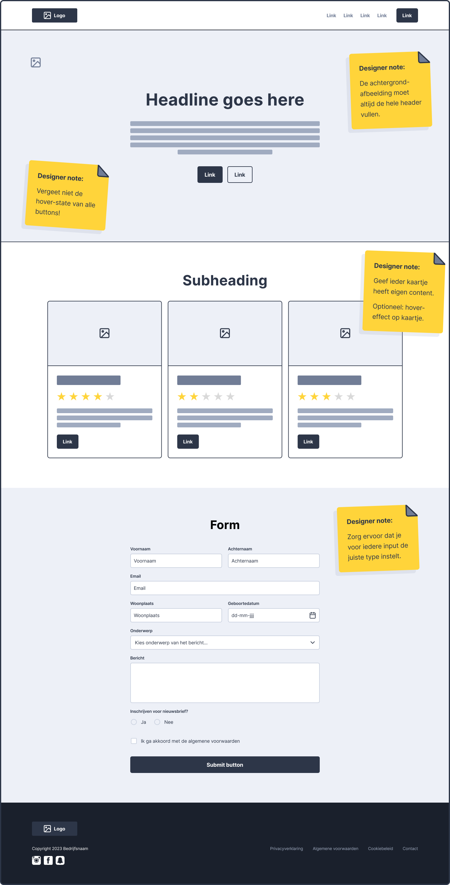
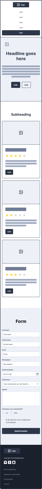

# Week 6 eindopdracht

**Inhoudsopgave**
- [Week 6 eindopdracht](#week-6-eindopdracht)
  - [De eindopdracht](#de-eindopdracht)
  - [Stap 1: Repository aanmaken](#stap-1-repository-aanmaken)
  - [Stap 2: GitHub Pages activeren](#stap-2-github-pages-activeren)
  - [Stap 3: Wireframes nabouwen](#stap-3-wireframes-nabouwen)
    - [Desktop wireframe](#desktop-wireframe)
    - [Mobile wireframe](#mobile-wireframe)

  

## De eindopdracht 

De informatie over de opdracht, de voorwaarden en het inleveren is te vinden in de cursushandleiding.
 
***Lees de cursushandleiding aandachtig door!***

 

## Stap 1: Repository aanmaken

- Ga naar [github.com](https://www.github.com) en maak een nieuwe `repository` aan voor de eindopdracht;
  - Voer `repository name` in (*bv. frontend-eindopdracht*);
  - Zorg ervoor dat `Public` is aangevinkt;
  - De overige velden kan je voor nu ongewijzigd laten en klik op `Create repository`;

 

## Stap 2: GitHub Pages activeren
De volgende stappen zijn pas uit te voeren wanneer je al bestanden hebt om te uploaden.
- Klik op `uploading an existing file` om je `index.html`, en `style.css` te uploaden en klik vervolgens op `Commit changes`;
  - ⚠️ Let op: sleep de index.html en de css-map het scherm in, zodat de mappenstructuur behouden blijft;
- Activeer Github Pages (Settings -> Pages) door onder het kopje **Branch** de optie `main` te selecteren en vervolgens op `Save` te klikken;
- Refresh de instellingenpagina een paar minuten later en dan staat bovenin de link naar jouw website. **Dát is de link die je moet inleveren in [Brightspace](https://brightspace.hr.nl/d2l/le/lessons/28886/topics/187340)**;
  - ⚠️ Let op: doorloop bovenstaande stappen van het uploaden nogmaals vóórdat je het inlevert, zodat de meest recente bestanden online te zien zijn.

 

## Stap 3: Wireframes nabouwen
De opdracht is om onderstaande wireframes na te bouwen, zoals omschreven in de cursushandleiding.
Hieronder staan nog enkele tips om je hierbij te helpen.

> ### Tips voor het bouwen
>
> - Bouw eerst de basisstructuur op met `semantic` tags;
> - Bouw één voor één de rijen na, in plaats van alles tegelijk op te willen lossen;
> - Gebruik `display:flex` om elementen naast elkaar te zetten;
> - Hou de `flex-documentatie` bij de hand, en gebruik de `flex-inspector` in je browser.
> - Je mag `
` gebruiken om binnen sections containers aan te maken, wanneer je dit puur voor de styling nodig hebt;
> - Gebruik `padding` en `margin` om witruimte toe te voegen rondom je containers en binnen je containers
> - 😱 Als iets niet lukt, ga dan niet "*paniek-googlen*". Geef aan waar je op vastloopt bij je docent, medestudent of peercoach.

### Desktop wireframe

 

### Mobile wireframe

  

[Wireframe desktop eindopdracht PDF](./wireframes/Wireframe-desktop.pdf)

[Wireframe mobile eindopdracht PDF](./wireframes/Wireframe-mobile.pdf)

