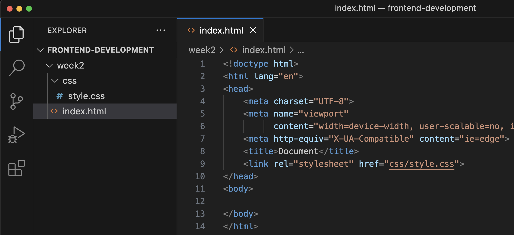

# Week 2

<br>

**Inhoudsopgave**
<!-- TOC -->
- [Week 2](#week-2)
  - [Opdracht 1 - Werkomgeving gereed maken](#opdracht-1---werkomgeving-gereed-maken)
  - [Opdracht 2 - HTML](#opdracht-2---html)
  - [Opdracht 3 - Basisstructuur HTML](#opdracht-3---basisstructuur-html)
  - [Opdracht 4 - CSS](#opdracht-4---css)
<!-- TOC -->

<br><hr><br>


## Opdracht 1 - Werkomgeving gereed maken

1. Maak een nieuw project aan door.....;
2. Maak vervolgens in dit nieuwe project een map aan met de naam `week2` (zonder spaties);
3. Maak in deze nieuwe map een HTML-bestand aan met de naam `index.html` en zet de basis-HTML neer door een `!` te typen en druk vervolgens op de tab-toets;
4. Maak een map aan met de naam `css` en maak hierin een CSS-bestand aan met de naam `style.css`;
5. Koppel het CSS-bestand aan het HTML-bestand door de volgende regel aan de `<head>` in de `index.html` toe te voegen:

```html
<link rel="stylesheet" href="css/style.css">
```

6. Zorg ervoor dat de `bestandsstructuur` en `index.html` er als volgt uitzien:



<br><hr><br>

## Opdracht 2 - HTML

Bouw het volgende ontwerp na (klik op de afbeelding om te vergroten):


<br>

> Wanneer je aan het programmeren bent en je hebt nog niet de teksten die uiteindelijk getoond moeten worden, dan
> gebruik je vaak zogenaamde `lorum ipsum` teksten ter vervanging.
> Deze teksten maak je zo lang als de uiteindelijke tekst ongeveer zal zijn, zodat je zo goed mogelijk het gewenste
> eindresultaat nabootst.
> Google op [lorum ipsum](https://www.google.nl/search?q=lorum+ipsum "Google op lorum ipsum") en je vindt genoeg
> websites en extensies die zulke teksten voor je genereren.

<br>

Je hebt hier het volgende voor nodig:

| HTML | CSS | Gebruikte kleuren |
| ---- | --- | ----------------- |
| h1   | -   | -                 |
| h2   |     |                   |
| p    |     |                   |

<br>

**Hulpbronnen opdracht 2**

1. [Introductievideo HTML & CSS](https://www.youtube.com/watch?v=0sQLdlAodfQ "Introductievideo HTML & CSS")
2. [Introductievideo HTML](https://www.youtube.com/watch?v=apC46Wfvd94 "Introductievideo HTML") (*bekijk tot 04:33, het
   deel erna is niet van toepassing voor dit vak*)

<br><hr><br>

## Opdracht 3 - Basisstructuur HTML

Bouw het volgende ontwerp na (klik op de afbeelding om te vergroten):


<br>
Je hebt hier het volgende voor nodig:

| HTML    | CSS | Gebruikte kleuren |
| ------- | --- | ----------------- |
| header  | -   | -                 |
| main    |     |                   |
| footer  |     |                   |
| nav     |     |                   |
| section |     |                   |
| h1      |     |                   |
| h2      |     |                   |
| p       |     |                   |
| a       |     |                   |

<br>

**Hulpbronnen opdracht 3**

1. [HTML cheatsheet](./images/HTML-cheatsheet.png  )
2. [Wireframe basisstructuur HTML](./images/Basisstructuur-HTML.jpg  )

<br><hr><br>

## Opdracht 4 - CSS

Bouw het volgende ontwerp na (klik op de afbeelding om te vergroten):


<br>

Je hebt hier het volgende voor nodig:

| HTML | CSS                    | Gebruikte kleuren |
| ---- | ---------------------- | ----------------- |
| -    | Selecting o.b.v. tag   | #717D96           |
|      | Selecting o.b.v. class | #A0ABC0           |
|      | font-family            | #E2E7F0           |
|      | color                  | #4A5468           |
|      | background-color       | #FFFFFF           |
|      | text-align             |                   |

<br>

**Hulpbronnen opdracht 4**

1. [CSS cheatsheet](./images/CSS-cheatsheet.png  )
2. [Introductievideo CSS](https://www.youtube.com/watch?v=apC46Wfvd94 "Introductievideo CSS") (*bekijk tot 11:00, het
   deel erna is niet van toepassing voor dit vak*)