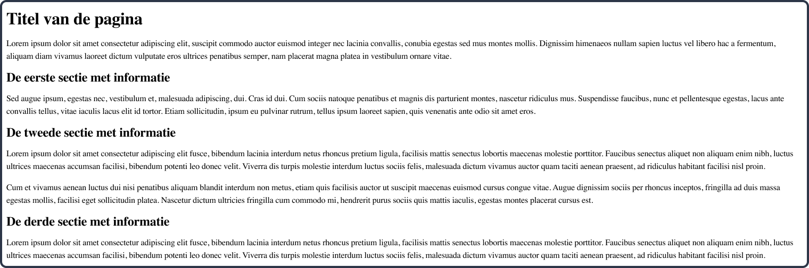

# Week 2

Intro

**Inhoudsopgave**
<!-- TOC -->
* [Week 2](#week-2)
  * [Opdracht 1 - Werkomgeving gereed maken](#opdracht-1---werkomgeving-gereed-maken)
  * [Opdracht 2 - Herhaling HTML](#opdracht-2---herhaling-html)
  * [Opdracht 3 - Basisstructuur HTML](#opdracht-3---basisstructuur-html)
  * [Opdracht 4 - CSS](#opdracht-4---css)
<!-- TOC -->

<br><br>

## Opdracht 1 - Werkomgeving gereed maken
1. Maak een nieuw project aan door.....;
2. Maak vervolgens in dit nieuwe project een map aan met de naam `week2` (zonder spaties);
3. Maak een HTML-bestand aan met de naam `index.html` en zet de basis-HTML neer door een `!` te typen en vervolgens TAB;
4. Maak een map aan met de naam `css` en maak hier een CSS-bestand aan met de naam `style.css`;
5. Koppel het CSS-bestand aan het HTML-bestand door de volgende regel aan de `<head>` in `index.html` toe te voegen:

```html
<link rel="stylesheet" href="css/style.css">
```

6. Zorg ervoor dat de `bestandsstructuur` en `index.html` er als volgt uitziet:


<br><br><hr><br>

## Opdracht 2 - Herhaling HTML

Bouw het volgende ontwerp na. Je hebt hier het volgende voor nodig:

| HTML | CSS | Gebruikte kleuren |
|------|-----|-------------------|
| h1   | -   | -                 |
| h2   |     |                   |
| p    |     |                   |   

> Wanneer je aan het programmeren bent en je hebt nog niet de teksten die uiteindelijk getoond moeten worden, dan
> gebruik je vaak zogenaamde `lorum ipsum` teksten ter vervanging.
> Deze teksten maak je zo lang als de uiteindelijke tekst ongeveer zal zijn, zodat je zo goed mogelijk het gewenste
> eindresultaat nabootst.
> Google op `lorum ipsum` en je vindt genoeg websites en extensies die zulke teksten voor je genereren.

<br>


> Klik op een afbeelding om deze te vergroten

<br><br><hr><br>

## Opdracht 3 - Basisstructuur HTML

Bouw het volgende ontwerp na. Je hebt hier het volgende voor nodig:

| HTML    | CSS | Gebruikte kleuren |
|---------|-----|-------------------|
| header  | -   | -                 |
| main    |     |                   |
| footer  |     |                   |
| nav     |     |                   |
| section |     |                   |
| h1      |     |                   |
| h2      |     |                   |
| p       |     |                   |   
| a       |     |                   |   


<br><br><hr><br>

## Opdracht 4 - CSS

Bouw het volgende ontwerp na. Je hebt hier het volgende voor nodig:

| HTML | CSS              | Gebruikte kleuren |
|------|------------------|-------------------|
| -    | font-family      | #4A5468           |
|      | color            | #717D96           |
|      | background-color | #E2E7F0           |   
|      | text-align       | #FFFFFF           |   


