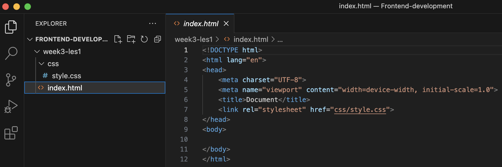

# Week 3 - Les 1

<br>

**Inhoudsopgave**
<!-- TOC -->
- [Week 3 - Les 1](#week-3---les-1)
  - [Opdracht 1 - Werkomgeving gereed maken](#opdracht-1---werkomgeving-gereed-maken)
    - [Opdracht 1a - Visual Studio Code installeren](#opdracht-1a---visual-studio-code-installeren)
    - [Opdracht 1b - Extensie Live Server installeren](#opdracht-1b---extensie-live-server-installeren)
    - [Opdracht 1c - Eerste project aanmaken](#opdracht-1c---eerste-project-aanmaken)
    - [Opdracht 1d - Bestandsstructuur HTML en CSS](#opdracht-1d---bestandsstructuur-html-en-css)
    - [Opdracht 1e - Code testen](#opdracht-1e---code-testen)
  - [Opdracht 2 - HTML](#opdracht-2---html)
    - [Dummy text](#dummy-text)
  - [Opdracht 3 - Basisstructuur HTML](#opdracht-3---basisstructuur-html)
  - [Opdracht 4 - CSS](#opdracht-4---css)
<!-- TOC -->

<br><hr><br>


## Opdracht 1 - Werkomgeving gereed maken

Om te kunnen beginnen met programmeren heb je een app nodig waarin dit kan, ook wel een [IDE](https://en.wikipedia.org/wiki/Integrated_development_environment) genoemd. In onderstaande stappen installeer je eerst `Visual Studio Code` en vervolgens de extensie `Live Server` en maak je je eerste project aan.

<br><br>

### Opdracht 1a - Visual Studio Code installeren

1. Ga naar https://code.visualstudio.com en klik op de download-knop;
2. Op een MacBook: open het gedownloade bestand en versleep de app naar de apps-map;
3. Op een Windows: open het gedownloade bestand en doorloop de stappen van de installatie met de standaard instellingen.
       

<br><br>


### Opdracht 1b - Extensie Live Server installeren
Om de door jou geschreven code te testen in de browser heb je een extensie nodig die dit mogelijk maakt, genaamd `Live Server`. Hiermee worden wijzigingen die je in de code maakt direct zichtbaar in de browser. In deze opdracht ga je de extensie alleen installeren, dus nog niet gebruiken, dat komt pas bij `Opdracht 1d`.

1. Wanneer Visual Studio Code geopend is, klik je links op `Extensions` (het icoontje met vier blokjes);
2. Voer `Live Server` in de zoekbalk in en installeer de extensie (het is degene gemaakt door Ritwick Dey);

<br>

> De browser is een app op jouw laptap waarmee je websites bekijkt. Bekende browsers zijn Microsoft Edge, Google Chrome, Firefox en Safari.

<br><br>

### Opdracht 1c - Eerste project aanmaken

Voor ieder project waaraan je werkt maak je een nieuw project aan in Visual Studio Code. Je gaat nu jouw eerste project aanmaken. Dit project kan je gedurende het vak gebruiken om de lesopdrachten te maken. Voor de eindopdracht maak je (op een later moment) weer een nieuw project aan.

1. Het aanmaken van een nieuw project is zo simpel als het aanmaken van een nieuwe map. Klik links boven op `File -> Open Folder...`;
2. Ga naar de map waar je dit project wilt neerzetten en maak daar een nieuwe map aan met de gewenste naam, bijvoorbeeld `frontend-development` (de naam mag geen spaties bevatten). Klik vervolgens op `Open` of `Map selecteren`;
3. Je hebt nu je eerste project aangemaakt!
4. Misschien krijg je een melding, klik dan op `Yes, I trust the authors`.

<br><br>

### Opdracht 1d - Bestandsstructuur HTML en CSS
Wanneer je met HTML en CSS werkt heb je altijd een bepaalde `bestandsstructuur` nodig van bestanden en mappen. Dat ga je in deze opdracht aanmaken. Aangezien je per les weer nieuwe opdrachten krijgt, heb je per les een nieuwe map nodig, met daarin dezelfde bestandsstructuur, dus je gaat nu als eerst een map voor de les van vandaag maken. De benodigde knoppen voor deze opdracht vind je aan de linkerzijde, rechts van de projectnaam.

1. Maak een map aan met de naam `week3-les1` (zonder spaties);
2. Maak in deze nieuwe map een bestand aan met de naam `index.html` en zet de basis-HTML neer door een `!` te typen en op de tab-toets te drukken;
3. Maak een map aan met de naam `css` en maak hierin een bestand aan met de naam `style.css`;
4. Koppel het CSS-bestand aan het HTML-bestand door de volgende regel aan de `<head>` in de `index.html` toe te voegen:

```html
<link rel="stylesheet" href="css/style.css">
```

5. Zorg ervoor dat de `bestandsstructuur` en de code van de `index.html` er als volgt uitzien:



<br><br>

### Opdracht 1e - Code testen
Het project is gereed en je bent klaar om te beginnen met programmeren! Om de door jou geschreven code te testen heb je de extensie `Live Server` nodig (geïnstalleerd in `Opdracht 1b`). Met de volgende stappen leer je hoe je deze extensie gebruikt.

1. Plaats eerst content in de `<body>`, bijvoorbeeld: `<h1>Hallo Wereld</h1>`
2. Klik met de rechter muistoets op `index.html` in de linker zijbalk en vervolgens op `Open with Live Server`.
3. Het document wordt nu geopend in de browser en je zou de heading `Hallo wereld` moeten zien.
4. Wanneer je iets wijzigt in je code en het bestand opslaat wordt dit automatisch bijgewerkt in de browser. Pas de h1 maar eens aan naar: `<h1>Hallo wereld, mijn naam is [JOUW NAAM]</h1>` en sla het bestand op (MacBook: CMD+S / Windows: CTRL+S). Wanneer je de browser opent zie je als het goed is dat deze wijziging direct zichtbaar is.

<br><hr><br>

## Opdracht 2 - HTML

Bouw het volgende ontwerp na (klik op de afbeelding om te vergroten):


<br>

### Dummy text

Bij het maken van je website kan het nodig zijn om alvast **dummy tekst** te plaatsen, om te zien of je layout goed werkt. Je kan hier [lorum ipsum tekst](https://www.google.nl/search?q=lorum+ipsum "Google op lorum ipsum") of [ChatGPT](https://chat.openai.com) voor gebruiken.

<br>

Je hebt hier het volgende voor nodig:

| HTML | CSS | Gebruikte kleuren |
| ---- | --- | ----------------- |
| h1   | -   | -                 |
| h2   |     |                   |
| p    |     |                   |

<br>

**Hulpbronnen opdracht 2**

1. [Introductievideo HTML & CSS](https://www.youtube.com/watch?v=0sQLdlAodfQ "Introductievideo HTML & CSS")
2. [Introductievideo HTML](https://www.youtube.com/watch?v=apC46Wfvd94 "Introductievideo HTML") (*bekijk tot 04:33, het
   deel erna is niet van toepassing voor dit vak*)

<br><hr><br>

## Opdracht 3 - Basisstructuur HTML

Bouw het volgende ontwerp na (klik op de afbeelding om te vergroten):


<br>
Je hebt hier het volgende voor nodig:

| HTML    | CSS | Gebruikte kleuren |
| ------- | --- | ----------------- |
| header  | -   | -                 |
| main    |     |                   |
| footer  |     |                   |
| nav     |     |                   |
| section |     |                   |
| h1      |     |                   |
| h2      |     |                   |
| p       |     |                   |
| a       |     |                   |

<br>

**Hulpbronnen opdracht 3**

1. [HTML cheatsheet](./images/HTML-cheatsheet.png  )
2. [Wireframe basisstructuur HTML](./images/Basisstructuur-HTML.jpg  )

<br><hr><br>

## Opdracht 4 - CSS

Bouw het volgende ontwerp na (klik op de afbeelding om te vergroten):


<br>

Je hebt hier het volgende voor nodig:

| HTML | CSS                    | Gebruikte kleuren |
| ---- | ---------------------- | ----------------- |
| -    | Selecting o.b.v. tag   | #717D96           |
|      | Selecting o.b.v. class | #A0ABC0           |
|      | font-family            | #E2E7F0           |
|      | color                  | #4A5468           |
|      | background-color       | #FFFFFF           |
|      | text-align             |                   |

<br>

**Hulpbronnen opdracht 4**

1. [CSS cheatsheet](./images/CSS-cheatsheet.png  )
2. [Introductievideo CSS](https://www.youtube.com/watch?v=apC46Wfvd94 "Introductievideo CSS") (*bekijk tot 11:00, het
   deel erna is niet van toepassing voor dit vak*)