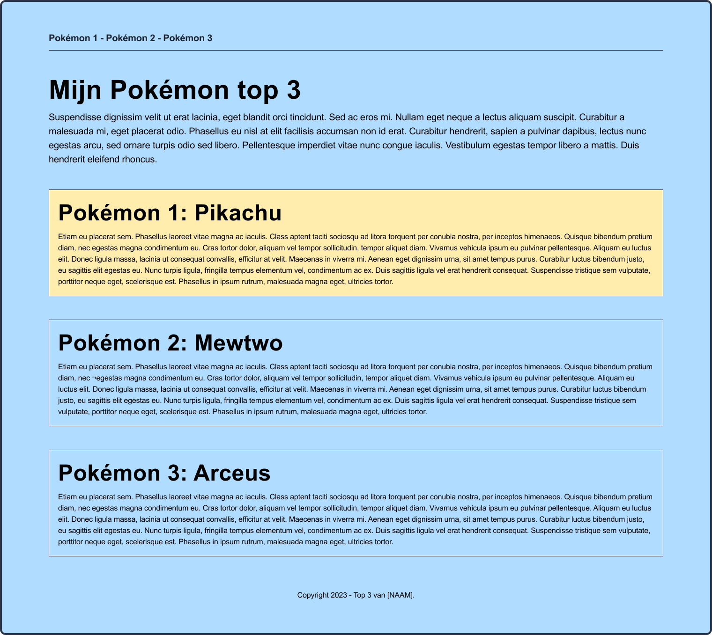

# Week 3 les 2

<br>

**Inhoudsopgave**
<!-- TOC -->
- [Week 3 les 2](#week-3-les-2)
  - [Semantiek](#semantiek)
  - [Werken met de inspector](#werken-met-de-inspector)
  - [Mini-oefeningen - Padding \& margin](#mini-oefeningen---padding--margin)
  - [Opdracht 1 - Semantische HTML](#opdracht-1---semantische-html)
  - [Opdracht 2 - Basis CSS](#opdracht-2---basis-css)
    - [Kleuren bepalen](#kleuren-bepalen)
  - [Opdracht 3 - Structuur aanbrengen met CSS](#opdracht-3---structuur-aanbrengen-met-css)
  - [Opdracht 4 - Formulier](#opdracht-4---formulier)
<!-- TOC -->

<br><hr><br>

## Semantiek
AANTEKENING: Je mag HTML ***nooit*** gebruiken om een element in de gewenste stijl te krijgen. Dit doe je altijd met CSS. Dus niet `<strong>` gebruiken, omdat het dan dikgedrukt wordt, gebruik het vanwege de semantische betekenis.

<br>

**Veelgebruikte semantische tags voor structuur**
| Tag     | Omschrijving                                                                            |
| ------- | --------------------------------------------------------------------------------------- |
| header  | De header (bovenkant) van de pagina.                                                    |
| main    | De hoofdinhoud van de pagina.                                                           |
| footer  | De footer (onderkant) van de pagina.                                                    |
| nav     | Bevat de navigatie van de website.                                                      |
| section | Is om één sectie van de pagina aan te duiden.                                           |
| article | Is voor onafhankelijke, op zichzelf staande inhoud, zoals nieuwsberichten en blogposts. |

<br>

**Veelgebruikte semantische tags voor content**
| Tag    | Omschrijving                                                                           | Voorbeeld in HTML                                                                                                         | Eindresultaat                                                                                   |
| ------ | -------------------------------------------------------------------------------------- | ------------------------------------------------------------------------------------------------------------------------- | ----------------------------------------------------------------------------------------------- |
| strong | Nadruk leggen op een gedeelte van de tekst, omdat deze belangrijk of urgent is.        | `<p>`Before entering, he read the warning at the entrance: `<strong>`Caution! Fire-breathing dragon ahead.`</strong></p>` | Before entering, he read the warning at the entrance: **Caution! Fire-breathing dragon ahead.** |
| em     | Wanneer je op een gedeelte van de tekst verbaal de nadruk wilt leggen, vaak één woord. | `<p>`This will be `<em>`very`</em>` dangerous.`</p>`                                                                      | This will be *very* dangerous.                                                                  |


<br><hr><br>

## Werken met de inspector

- Open de inspector op een specifiek HTML-element door met de rechter muistoets op dat element te klikken en vervolgens op **Inspecteren**;
  - Ook is de inspector te openen met de sneltoets ⌥⌘i op Mac en F12 op Windows;
- Van het geselecteerde element zie je ook alle bijbehorende CSS staan. Deze CSS is in de inspector aan te passen en dit is dan direct zichtbaar in de browser. Zo kan je spelen met de waardes en real-time wijzingen zien om het ontwerp te bepalen. Dit noemen we `Designing in the browser`;
  -  **Let op:** wanneer je CSS in de inspector wijzigt, verandert het ***niet*** in de bestanden in Visual Studio Code. Dit moet je handmatig wijzigen;


<br><hr><br>

## Mini-oefeningen - Padding & margin

[Doorloop alle mini-oefeningen.](./mini-oefeningen/padding-margin)

<br><hr><br>

## Opdracht 1 - Semantische HTML

Bouw het volgende ontwerp na (klik op de afbeelding om te vergroten):

> **@TODO** Breidt het ontwerp uit, zodat ook de basisstructuur (nav, header, main, footer) erin moet.


<br>

Je hebt hier het volgende voor nodig:

| HTML    | CSS | Gebruikte kleuren |
| ------- | --- | ----------------- |
| header  | -   | -                 |
| main    |     |                   |
| footer  |     |                   |
| nav     |     |                   |
| section |     |                   |
| h1      |     |                   |
| h2      |     |                   |
| p       |     |                   |
| a       |     |                   |


<br><hr><br>

## Opdracht 2 - Basis CSS

Bouw het volgende ontwerp na (klik op de afbeelding om te vergroten):


<br>

### Kleuren bepalen

Elementen hebben een voorgrond (tekst) en achtergrondkleur. Deze kan je op verschillende manieren bepalen

```css
div {
    color: aliceblue;                               /* Kleur naam */
    color: #FFFFFF;                                 /* Hexadecimale kleur */
    color: rgb(255, 255, 255);                      /* RGB kleur */
    color: rgba(255, 255, 255, 0.5);                /* RGB kleur met transparantie */

    background-color: darkblue;                     /* Kleur naam */
    background-color: #FFFFFF;                      /* Hexadecimale kleur */
    background-color: rgb(255, 255, 255);           /* RGB kleur */
    background-color: rgba(255, 255, 255, 0.5);     /* RGB kleur met transparantie */
}
```


<br>

Je hebt hier het volgende voor nodig:

| HTML | CSS                    | Gebruikte kleuren |
| ---- | ---------------------- | ----------------- |
| -    | Selecting o.b.v. tag   | #B0DCFF           |
|      | Selecting o.b.v. class | #000000           |
|      | font-family            |                   |
|      | color                  |                   |
|      | background-color       |                   |
|      | text-align             |                   |

<br><hr><br>

## Opdracht 3 - Structuur aanbrengen met CSS

Bouw het volgende ontwerp na (klik op de afbeelding om te vergroten):
> Zorg ervoor dat je de afbeeldingen eerst in jouw project zet en die vervolgens
gebruikt in de HTML.



<br>

Je hebt hier het volgende voor nodig:

| HTML | CSS | Gebruikte kleuren |
| ---- | --- | ----------------- |
| img  | -   | -                 |


**Download de volgende afbeeldingen en plaats in jouw project**
<br>


<br><hr><br>

## Opdracht 4 - Formulier

Bouw het formulier in volgende ontwerp na (klik op de afbeelding om te vergroten):


<br>

Je hebt hier het volgende voor nodig:

| HTML  | CSS                      | Gebruikte kleuren |
| ----- | ------------------------ | ----------------- |
| form  | width                    | #A0ABC0           |
| input | background-color         | #2D3648           |
| label | **BONUS:** border-radius | #FFFFFF           |
| h2    |                          |                   |
| p     |                          |                   |