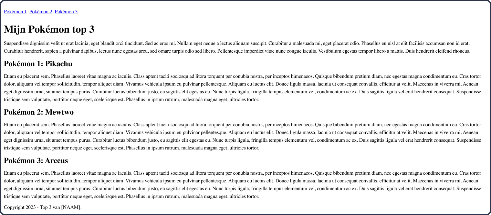

# Week 3 les 2

<br>

**Inhoudsopgave**
<!-- TOC -->
- [Week 3 les 2](#week-3-les-2)
- [Inhoud](#inhoud)
  - [Semantiek](#semantiek)
  - [Werken met de inspector](#werken-met-de-inspector)
    - [Opdracht inspector](#opdracht-inspector)
  - [Relatieve units](#relatieve-units)
- [Quiz over semantische HTML](#quiz-over-semantische-html)
- [Mini-oefeningen - Padding \& margin](#mini-oefeningen---padding--margin)
- [Opdracht: Top 3](#opdracht-top-3)
  - [Opdracht 1 - Semantische HTML](#opdracht-1---semantische-html)
  - [Opdracht 2 - CSS: teksten en kleuren](#opdracht-2---css-teksten-en-kleuren)
  - [Opdracht 3 - CSS: padding \& margin](#opdracht-3---css-padding--margin)
<!-- TOC -->

<br><hr><br>

# Inhoud

## Semantiek
AANTEKENING: Je mag HTML ***nooit*** gebruiken om een element in de gewenste stijl te krijgen. Dit doe je altijd met CSS. Dus niet `<strong>` gebruiken, omdat het dan dikgedrukt wordt, gebruik het vanwege de semantische betekenis.

<br>

**Veelgebruikte semantische tags voor structuur**
| Tag     | Omschrijving                                                                            |
| ------- | --------------------------------------------------------------------------------------- |
| header  | De header (bovenkant) van de pagina.                                                    |
| main    | De hoofdinhoud van de pagina.                                                           |
| footer  | De footer (onderkant) van de pagina.                                                    |
| nav     | Bevat de navigatie van de website.                                                      |
| section | Is om één sectie van de pagina aan te duiden.                                           |
| article | Is voor onafhankelijke, op zichzelf staande inhoud, zoals nieuwsberichten en blogposts. |

<br>

**Veelgebruikte semantische tags voor content**
| Tag    | Omschrijving                                                                           | Voorbeeld in HTML                                                                                                         | Eindresultaat                                                                                   |
| ------ | -------------------------------------------------------------------------------------- | ------------------------------------------------------------------------------------------------------------------------- | ----------------------------------------------------------------------------------------------- |
| strong | Nadruk leggen op een gedeelte van de tekst, omdat deze belangrijk of urgent is.        | `<p>`Before entering, he read the warning at the entrance: `<strong>`Caution! Fire-breathing dragon ahead.`</strong></p>` | Before entering, he read the warning at the entrance: **Caution! Fire-breathing dragon ahead.** |
| em     | Wanneer je op een gedeelte van de tekst verbaal de nadruk wilt leggen, vaak één woord. | `<p>`This will be `<em>`very`</em>` dangerous.`</p>`                                                                      | This will be *very* dangerous.                                                                  |


<br><hr><br>

## Werken met de inspector

- Open de inspector op een specifiek HTML-element door met de rechter muistoets op dat element te klikken en vervolgens op **Inspecteren**;
  - Ook is de inspector te openen met de sneltoets ⌥⌘i op Mac en F12 op Windows;
- Van het geselecteerde element zie je ook alle bijbehorende CSS staan. Deze CSS is in de inspector aan te passen en dit is dan direct zichtbaar in de browser. Zo kan je spelen met de waardes en real-time wijzingen zien om het ontwerp te bepalen. Dit noemen we `Designing in the browser`;
  -  **Let op:** wanneer je CSS in de inspector wijzigt, verandert het ***niet*** in de bestanden in Visual Studio Code. Dit moet je handmatig wijzigen;


<br>

### Opdracht inspector
Nu je weet hoe je de inspector opent, wordt het tijd om deze te gaan gebruiken. Ga naar een website die jij vaak bezoekt. Deze kan over jouw hobby gaan, maar het kan ook die van een supermarkt zijn, dat maakt niet uit. Open de inspector en voer de volgende opdrachten daarin uit:

1. Pas van minimaal 3 teksten de kleur aan;
2. Pas van minimaal 3 teksten het lettertype aan;
3. Pas van minimaal 3 elementen de achtergrondkleur aan;
4. Pas de achtergrondkleur van de gehele webpagina aan;

<br><hr><br>

## Relatieve units

⚠️⚠️⚠️ **@TODO** maak cheatsheet over relatieve units ⚠️⚠️⚠️

<br><hr><br><br><br><br><br>

# Quiz over semantische HTML
[Klik hier om de quiz over semantische HTML te doen](./quiz/)

<br><hr><br><br><br><br><br>


# Mini-oefeningen - Padding & margin

[Klik hier om de naar de mini-oefeningen te gaan.](./mini-oefeningen/padding-margin)


<br><hr><br><br><br><br><br>


# Opdracht: Top 3

## Opdracht 1 - Semantische HTML

Maak in het project waar jij de lesopdrachten in maakt eerst een nieuwe map aan met de naam `top3` (zonder spaties).
<br>
Bouw vervolgens het volgende ontwerp na (klik op de afbeelding om te vergroten).
<br>
Je mag je eigen top 3 bedenken, maar gebruik verder testteksten. De focus ligt in deze opdracht **niet** op de inhoud, maar op de code.



<br>

>Denk nog even terug aan de wireframe die je gezien hebt tijdens de CMGT-dag, met daarin de basisstructuur van een webpagina. Voor deze opdracht heb je alleen de `nav` niet nodig, de rest wel.
> <br>
> <br>
>

<br>

Je hebt hier het volgende voor nodig:

| HTML    | CSS | Gebruikte kleuren |
| ------- | --- | ----------------- |
| header  | -   | -                 |
| main    |     |                   |
| footer  |     |                   |
| section |     |                   |
| h1      |     |                   |
| h2      |     |                   |
| p       |     |                   |
| a       |     |                   |


<br><hr><br>

## Opdracht 2 - CSS: teksten en kleuren

Bouw het volgende ontwerp na (klik op de afbeelding om te vergroten).


  
  <br>
  
  Je hebt hier het volgende voor nodig:
  
  | HTML | CSS                    | Gebruikte kleuren |
  | ---- | ---------------------- | ----------------- |
  | -    | Selectors o.b.v. tag   | #B0DCFF           |
  |      | Selectors o.b.v. class | #000000           |
  |      | font-family            |                   |
  |      | color                  |                   |
  |      | background-color       |                   |
  |      | text-align             |                   |
  |      | border                 |                   |

<br>


>### Kleuren bepalen
>
>Elementen hebben een tekstkleur en een achtergrondkleur. Deze kan je op verschillende manieren bepalen:
>
>```css
>section {
>
>    /* Tekstkleur bepalen */
>    color: aliceblue;                               /* Kleur naam */
>    color: #FFFFFF;                                 /* Hexadecimale kleur */
>    color: rgb(255, 255, 255);                      /* RGB kleur */
>    color: rgba(255, 255, 255, 0.5);                /* RGB kleur met transparantie */
>
>    /* Achtergrond bepalen */
>    background-color: darkblue;                     /* Kleur naam */
>    background-color: #FFFFFF;                      /* Hexadecimale kleur */
>    background-color: rgb(255, 255, 255);           /* RGB kleur */
>    background-color: rgba(255, 255, 255, 0.5);     /* RGB kleur met >transparantie */
>}
>```

<br><hr><br>

## Opdracht 3 - CSS: padding & margin

Bouw het volgende ontwerp na (klik op de afbeelding om te vergroten).


<br>

Je hebt hier het volgende voor nodig:

| HTML | CSS     | Gebruikte kleuren |
| ---- | ------- | ----------------- |
| -    | padding | -                 |
|      | margin  |                   |

