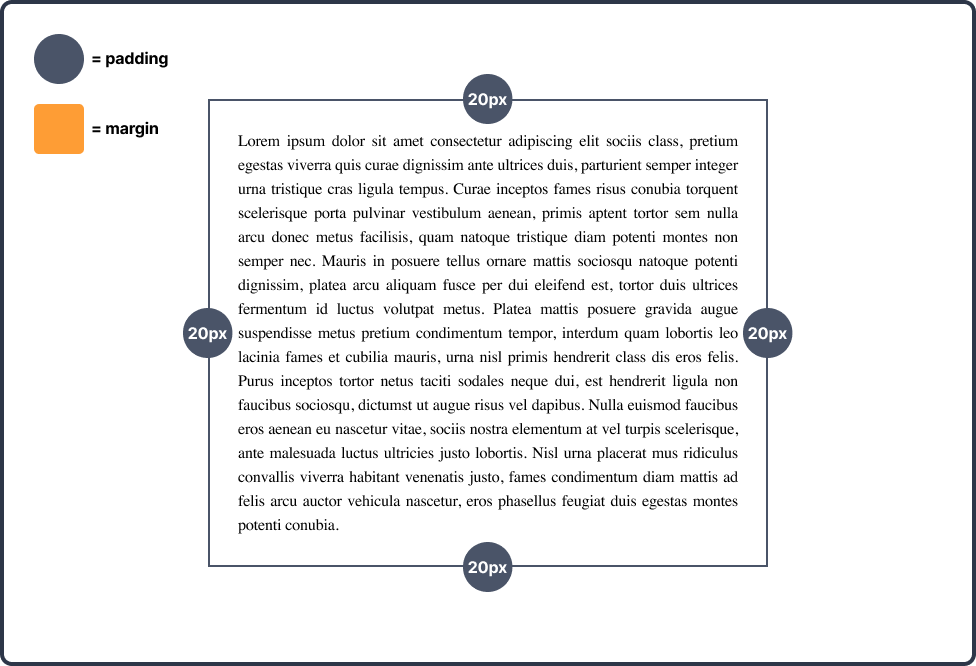
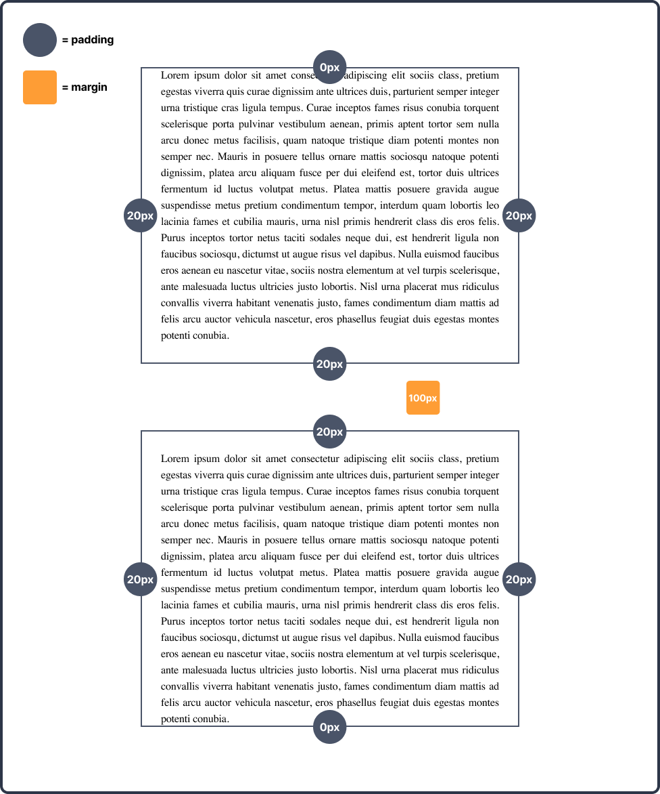

# Week 3 - Mini-oefeningen - Padding & margin

 

**Inhoudsopgave**
<!-- TOC -->
- [Week 3 - Mini-oefeningen - Padding \& margin](#week-3---mini-oefeningen---padding--margin)
  - [Mini-oefening 1](#mini-oefening-1)
  - [Mini-oefening 2](#mini-oefening-2)
<!-- TOC -->

 
 

## Mini-oefening 1

Bouw het volgende ontwerp na (klik op de afbeelding om te vergroten):

 
 

## Mini-oefening 2

Bouw het volgende ontwerp na (klik op de afbeelding om te vergroten):

 
 

[Terug naar hoofdpagina](../..)