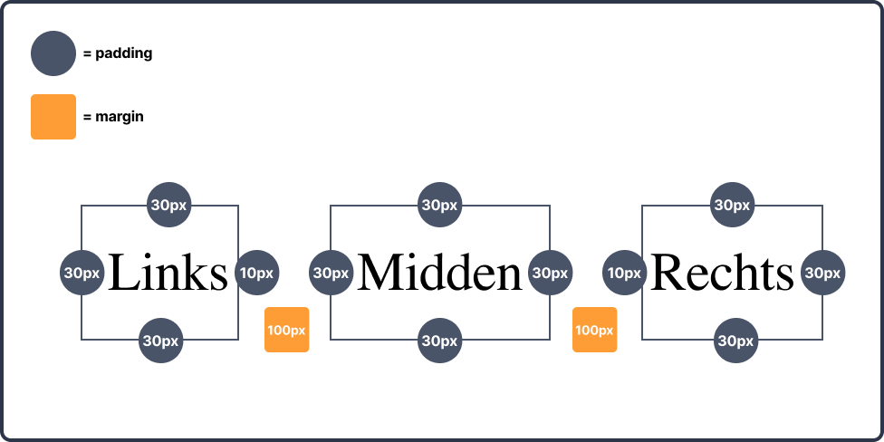
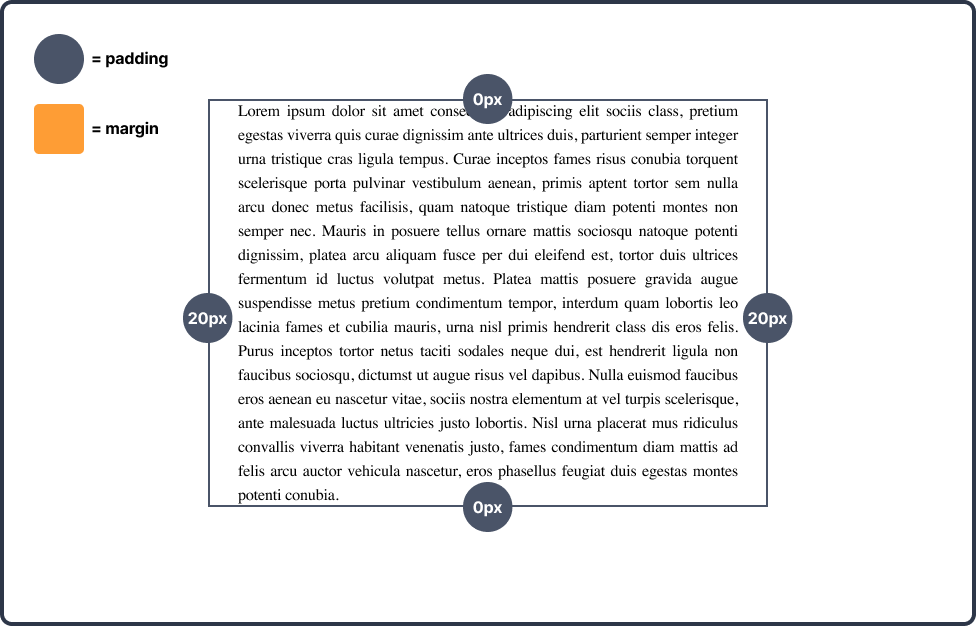
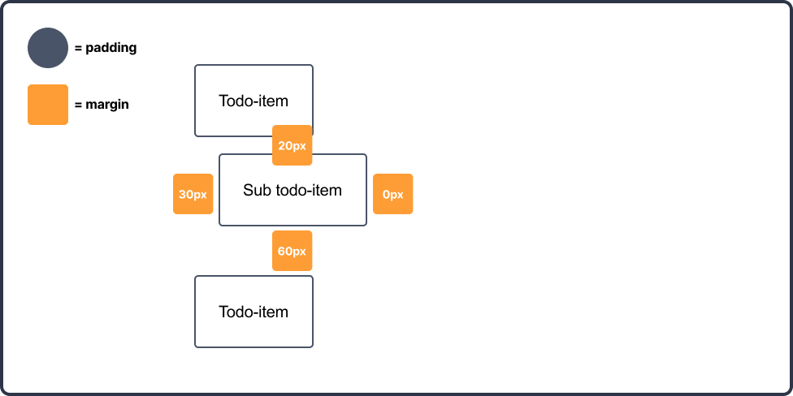
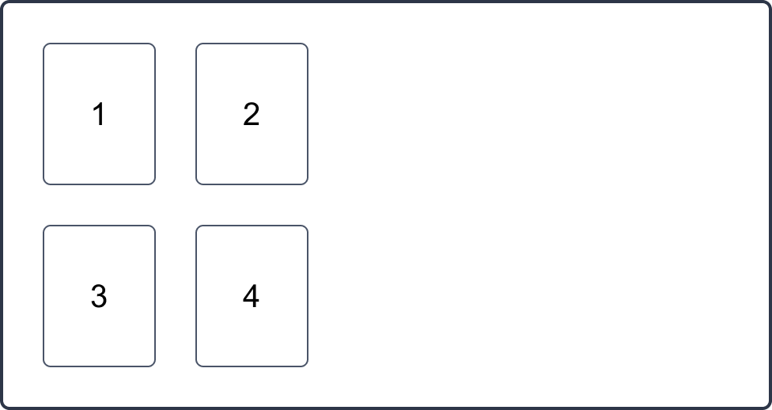

# Week 3 - Mini-oefeningen - Padding & margin

 

**Inhoudsopgave**
<!-- TOC -->
- [Week 3 - Mini-oefeningen - Padding \& margin](#week-3---mini-oefeningen---padding--margin)
  - [Mini-oefening 1](#mini-oefening-1)
  - [Mini-oefening 2](#mini-oefening-2)
  - [Mini-oefening 3](#mini-oefening-3)
  - [Mini-oefening 4](#mini-oefening-4)
  - [Mini-oefening 5](#mini-oefening-5)
  - [Mini-oefening 6](#mini-oefening-6)
<!-- TOC -->

 
 

## Mini-oefening 1

Bouw het volgende ontwerp na met de aangegeven waardes (klik op de afbeelding om te vergroten).
 Je mag alleen maar in het CSS-bestand werken met `padding`.

 
 

## Mini-oefening 2

Bouw het volgende ontwerp na met de aangegeven waardes (klik op de afbeelding om te vergroten).
 Je mag alleen maar in het CSS-bestand werken met `selectors`, `padding` en `margin`.

 
 

## Mini-oefening 3

Bouw het volgende ontwerp na met de aangegeven waardes (klik op de afbeelding om te vergroten).
 Je mag alleen maar in het CSS-bestand werken met `selectors`, `padding` en `margin`.

 
 

## Mini-oefening 4

Bouw het volgende ontwerp na met de aangegeven waardes (klik op de afbeelding om te vergroten).
> **LET OP:** Je moet het met 1 regel code oplossen in het CSS-bestand.

 
 

## Mini-oefening 5

Bouw het volgende ontwerp na met de aangegeven waardes (klik op de afbeelding om te vergroten).
> **LET OP:** Je moet het met 1 regel code oplossen in het CSS-bestand.

 
 

## Mini-oefening 6

Bouw het volgende ontwerp *op het blote oog* na (klik op de afbeelding om te vergroten).
 Je mag alleen maar in het CSS-bestand werken met `padding` en `margin`.

 
 

[Terug naar hoofdpagina](../..)