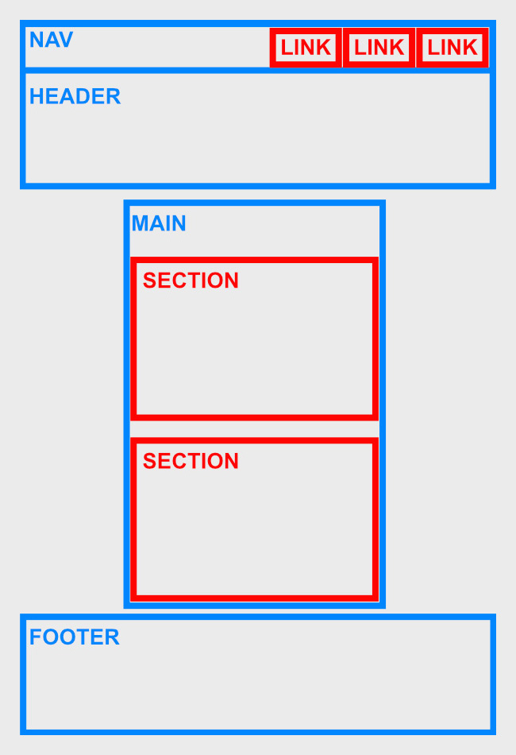

# Opdrachten Week 3 - Les 2

## Opdracht 1 - Semantische HTML

Bouw het volgende ontwerp na (klik op de afbeelding om te vergroten).
<br>
Je mag je eigen top 3 bedenken, maar gebruik verder testteksten. De focus ligt in deze opdracht **niet** op de inhoud, maar op de code.

>⚠️⚠️⚠️ **@TODO** Breidt het ontwerp uit, zodat ook de basisstructuur (nav, header, main, footer) erin moet. ⚠️⚠️⚠️


<br>

>Denk nog even terug aan de wireframe die je gezien hebt bij de studiekeuzecheck, met daarin de basisstructuur van een webpagina. Voor deze opdracht heb je alleen de `nav` niet nodig.
> <br>
> <br>
>

<br>

Je hebt hier het volgende voor nodig:

| HTML    | CSS | Gebruikte kleuren |
| ------- | --- | ----------------- |
| header  | -   | -                 |
| main    |     |                   |
| footer  |     |                   |
| nav     |     |                   |
| section |     |                   |
| h1      |     |                   |
| h2      |     |                   |
| p       |     |                   |
| a       |     |                   |


<br><hr><br>

## Opdracht 2 - Basis CSS

Bouw het volgende ontwerp na (klik op de afbeelding om te vergroten).


<br>

### Kleuren bepalen

Elementen hebben een tekstkleur en een achtergrondkleur. Deze kan je op verschillende manieren bepalen:

```css
section {

    /* Tekstkleur bepalen */
    color: aliceblue;                               /* Kleur naam */
    color: #FFFFFF;                                 /* Hexadecimale kleur */
    color: rgb(255, 255, 255);                      /* RGB kleur */
    color: rgba(255, 255, 255, 0.5);                /* RGB kleur met transparantie */

    /* Achtergrond bepalen */
    background-color: darkblue;                     /* Kleur naam */
    background-color: #FFFFFF;                      /* Hexadecimale kleur */
    background-color: rgb(255, 255, 255);           /* RGB kleur */
    background-color: rgba(255, 255, 255, 0.5);     /* RGB kleur met transparantie */
}
```


<br>

Je hebt hier het volgende voor nodig:

| HTML | CSS                    | Gebruikte kleuren |
| ---- | ---------------------- | ----------------- |
| -    | Selectors o.b.v. tag   | #B0DCFF           |
|      | Selectors o.b.v. class | #000000           |
|      | font-family            |                   |
|      | color                  |                   |
|      | background-color       |                   |
|      | text-align             |                   |
|      | border                 |                   |

<br><hr><br>

## Opdracht 3 - Structuur aanbrengen met CSS

Bouw het volgende ontwerp na (klik op de afbeelding om te vergroten).
> Zorg ervoor dat je de afbeeldingen eerst in jouw project zet en die vervolgens
gebruikt in de HTML.


<br>

Je hebt hier het volgende voor nodig:

| HTML | CSS | Gebruikte kleuren |
| ---- | --- | ----------------- |
| img  | -   | -                 |


**Download de volgende afbeeldingen en plaats in jouw project**
<br>


<br><hr><br>

>⚠️⚠️⚠️ **@TODO** Formulier eruit halen en verplaatsen naar week5-1? ⚠️⚠️⚠️ 

## Opdracht 4 - Formulier

Bouw het formulier in volgende ontwerp na (klik op de afbeelding om te vergroten).


<br>

Je hebt hier het volgende voor nodig:

| HTML  | CSS                      | Gebruikte kleuren |
| ----- | ------------------------ | ----------------- |
| form  | width                    | #A0ABC0           |
| input | background-color         | #2D3648           |
| label | **BONUS:** border-radius | #FFFFFF           |
| h2    |                          |                   |
| p     |                          |                   |