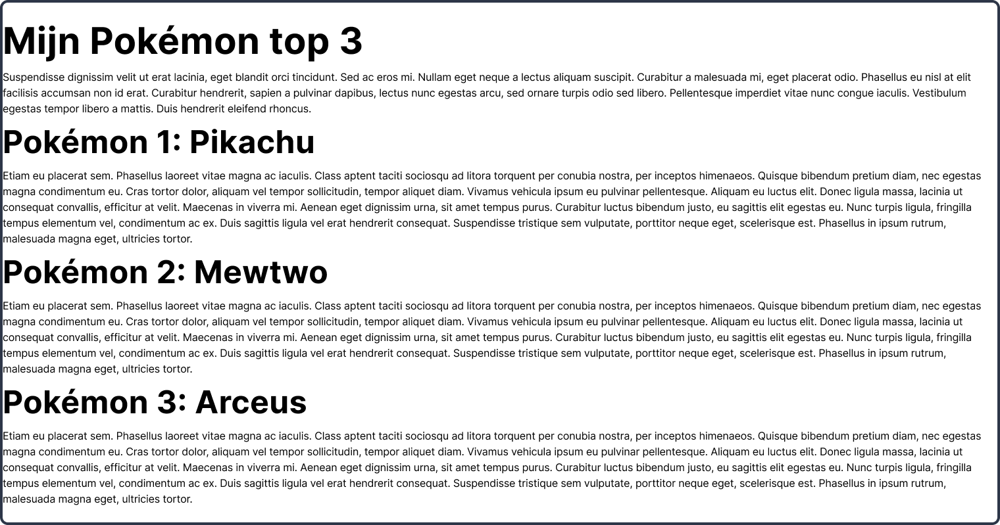
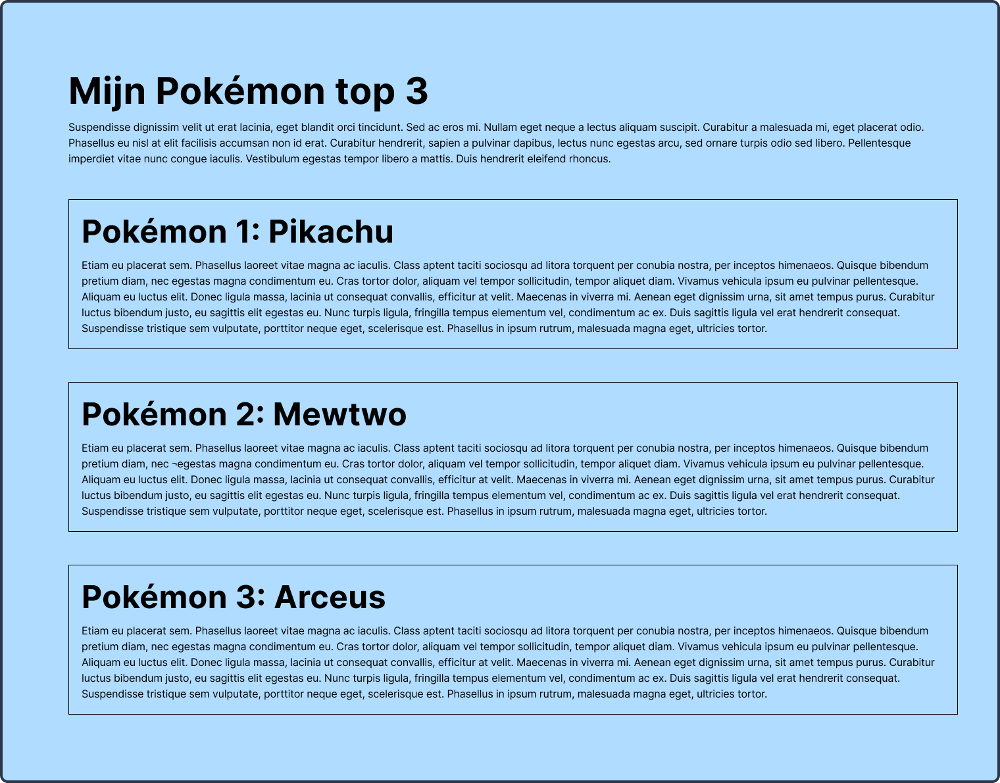
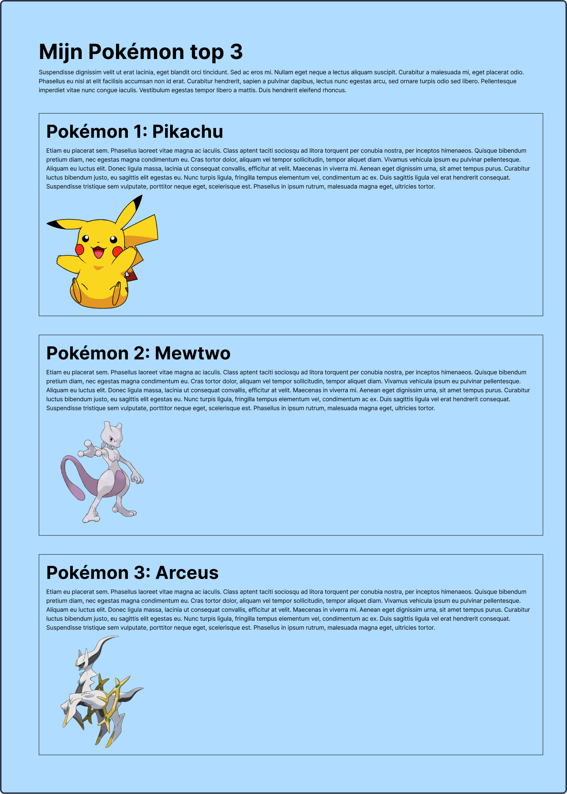
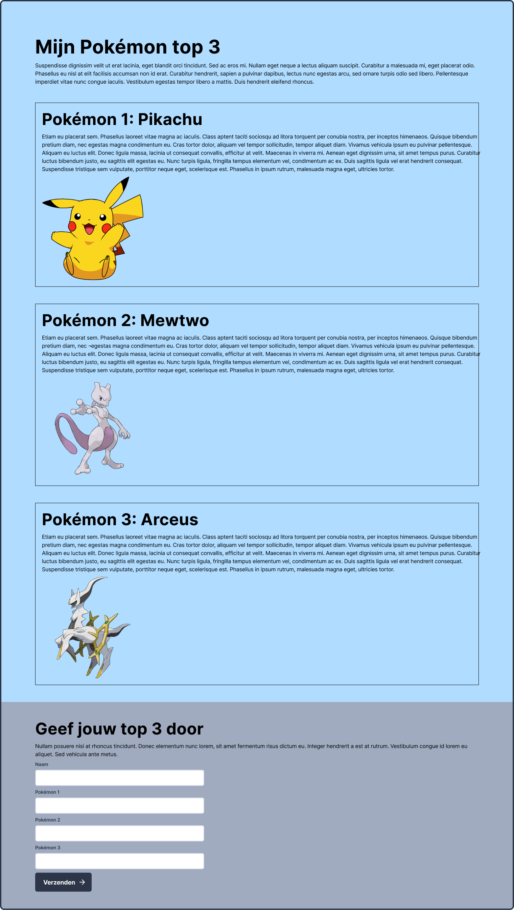

# Week 3

Intro

## Opdracht 1 - Semantische HTML
Maak het volgende ontwerp 1-op-1 na. Zorg ervoor dat je precies dezelfde opbouw hebt. Denk hierbij ook terug aan hoe je bij de studiekeuzecheck verschillende secties maakte.
 
In deze opdracht werk je nog niet met CSS, dat komt pas bij opdracht 2.

> Gebruik voor de teksten de zogenaamde **lorum ipsum**. Dit gebruiken developers vaak wanneer de uiteindelijke teksten er nog niet zijn om toch genoeg tekst te hebben. Google op **lorum ipsum** en je vindt genoeg websites en extensies die dit voor je genereren.

 

 *Klik op de afbeelding om te vergroten.*

 

## Opdracht 2 - Basis CSS
Maak het volgende ontwerp 1-op-1 na. Zorg ervoor dat je exact dezelfde kleuren, margins en paddings gebruikt.

 *Klik op de afbeelding om te vergroten.*

 

## Opdracht 3 - Structuur aanbrengen met CSS
Maak het volgende ontwerp 1-op-1 na. Zorg ervoor dat je de afbeeldingen eerst in jouw project zet en die vervolgens inlaadt.

 *Klik op de afbeelding om te vergroten.*

 

## Opdracht 4 - Formulier
Maak het formulier 1-op-1 na. 

 *Klik op de afbeelding om te vergroten.*