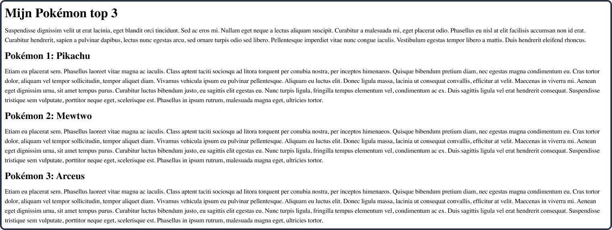

# Week 3

<!-- TOC -->
* [Week 3](#week-3)
  * [Opdracht 1 - Semantische HTML](#opdracht-1---semantische-html)
  * [Opdracht 2 - Basis CSS](#opdracht-2---basis-css)
  * [Opdracht 3 - Structuur aanbrengen met CSS](#opdracht-3---structuur-aanbrengen-met-css)
  * [Opdracht 4 - Formulier](#opdracht-4---formulier)
<!-- TOC -->

  
 

## Opdracht 1 - Semantische HTML

Bouw het volgende ontwerp na (klik op de afbeelding om te vergroten):

> **@TODO** Breidt het ontwerp uit, zodat ook de basisstructuur (nav, header, main, footer) erin moet.

Zorg ervoor dat je precies dezelfde opbouw hebt. Denk hierbij ook terug aan hoe je
bij de studiekeuzecheck verschillende secties maakte.

Je hebt hier het volgende voor nodig:

| HTML    | CSS | Gebruikte kleuren |
|---------|-----|-------------------|
| header  | -   | -                 |
| main    |     |                   |
| footer  |     |                   |
| nav     |     |                   |
| section |     |                   |
| h1      |     |                   |
| h2      |     |                   |
| p       |     |                   |   
| a       |     |                   |   
 
In deze opdracht werk je nog niet met CSS, dat komt pas bij opdracht 2.

  
 

## Opdracht 2 - Basis CSS

Bouw het volgende ontwerp na (klik op de afbeelding om te vergroten):

Zorg ervoor dat je exact dezelfde kleuren, margins en paddings gebruikt.

Je hebt hier het volgende voor nodig:

| HTML | CSS                    | Gebruikte kleuren |
|------|------------------------|-------------------|
| -    | Selecting o.b.v. tag   | .....             |
|      | Selecting o.b.v. class | .....             |
|      | font-family            | .....             |
|      | color                  | .....             |
|      | background-color       | .....             |   
|      | text-align             | .....             |   

  
 

## Opdracht 3 - Structuur aanbrengen met CSS

Bouw het volgende ontwerp na (klik op de afbeelding om te vergroten):
> Zorg ervoor dat je de afbeeldingen eerst in jouw project zet en die vervolgens
gebruikt in de HTML.

Je hebt hier het volgende voor nodig:

| HTML | CSS | Gebruikte kleuren |
|------|-----|-------------------|
| -    | -   | -                 |

**Download de volgende afbeeldingen en plaats in jouw project**
 

  
 

## Opdracht 4 - Formulier

Bouw het volgende ontwerp na (klik op de afbeelding om te vergroten):

Je hebt hier het volgende voor nodig:

| HTML | CSS | Gebruikte kleuren |
|------|-----|-------------------|
| -    | -   | -                 |