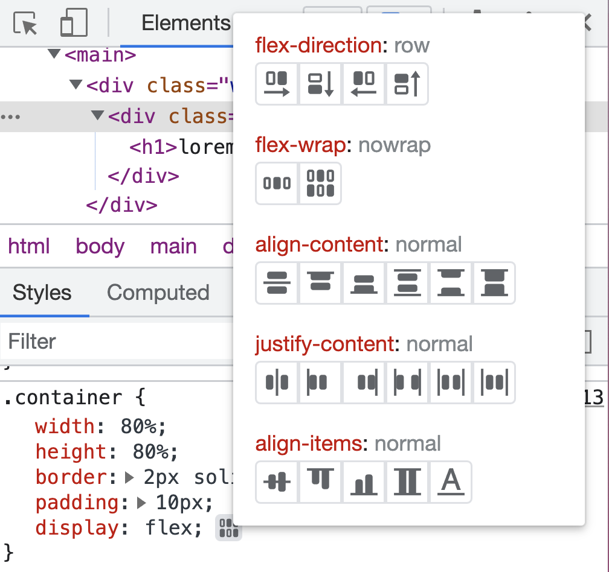

# Week 4 les 1

- Werken met flex. 
- Afbeeldingen en tekst naast elkaar
- Nav bar bouwen
- Card grid bouwen met flex-wrap
- CSS Tricks poster
- Flex inspector

   

## CSS Tricks Poster

https://css-tricks.com/snippets/css/a-guide-to-flexbox/

   

## Flex inspector 🔍

Settings uitproberen in de inspector

https://developer.chrome.com/docs/devtools/css/flexbox/

## Mini-oefeningen - Padding & margin

[Doorloop alle mini-oefeningen.](./mini-oefeningen/flexbox)

 
 