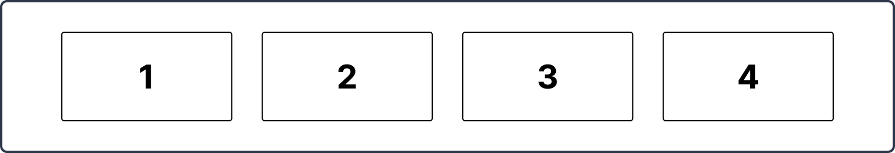
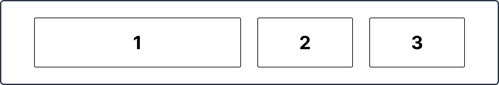
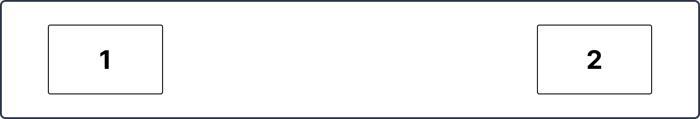
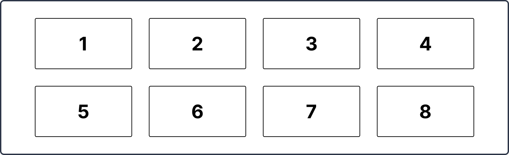
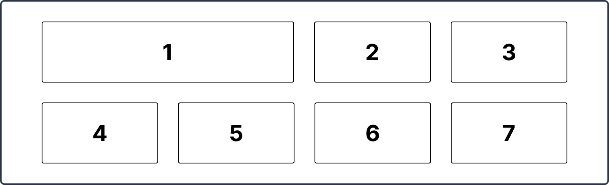

# Week 4 - Mini-oefeningen - Flexbox

 

**Inhoudsopgave**
<!-- TOC -->
- [Week 4 - Mini-oefeningen - Flexbox](#week-4---mini-oefeningen---flexbox)
  - [Mini-oefening 1](#mini-oefening-1)
  - [Mini-oefening 2](#mini-oefening-2)
  - [Mini-oefening 3](#mini-oefening-3)
  - [Mini-oefening 4](#mini-oefening-4)
  - [Mini-oefening 5](#mini-oefening-5)
  - [Mini-oefening 6](#mini-oefening-6)
<!-- TOC -->

 
 

## Mini-oefening 1

Bouw het volgende ontwerp na (klik op de afbeelding om te vergroten):

 
 

## Mini-oefening 2

Bouw het volgende ontwerp na (klik op de afbeelding om te vergroten):

 
 

## Mini-oefening 3

Bouw het volgende ontwerp na (klik op de afbeelding om te vergroten):

 
 

## Mini-oefening 4

Bouw het volgende ontwerp na (klik op de afbeelding om te vergroten):

 
 

## Mini-oefening 5

Bouw het volgende ontwerp na (klik op de afbeelding om te vergroten):

 
 

## Mini-oefening 6

Bouw het volgende ontwerp na (klik op de afbeelding om te vergroten):

 
 

[Terug naar week 3](../..)