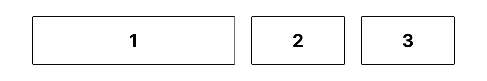
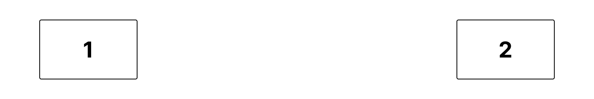

# Week 4 - Dinsdag

- [Week 4 - Dinsdag](#week-4---dinsdag)
- [Inhoud](#inhoud)
  - [Flexbox](#flexbox)
  - [Flexbox-opties](#flexbox-opties)
  - [Flexbox-inspector 🔍](#flexbox-inspector-)
- [Mini oefeningen - Flexbox](#mini-oefeningen---flexbox)

 
 

# Inhoud

## Flexbox
Tot nu toe heb je elementen alleen nog maar onder elkaar gezet. Wil je de mogelijkheid om elementen ook naast elkaar te zetten? Dan kan je Flexbox gebruiken*. Naast de mogelijkheid om elementen naast elkaar te zetten, krijg je ook de mogelijkheid om de uitlijning van de elementen te bepalen. Kijk maar eens naar het volgende voorbeeld:

 
Met slechts 4 regels code van Flexbox krijg je het eindresultaat dat de drie elementen naast elkaar staan, dat er een ruimte tussen de elementen zit, dat ze als geheel de hele breedte vullen en dat element 1 dubbel zo groot is als element 2 en 3. Maar het volgende is bijvoorbeeld ook mogelijk:
  

 
Om dit eindresultaat te krijgen heb je zelfs maar 3 regels code van Flexbox nodig. Hopelijk krijg je hiermee al een eerste indruk wat de kracht van Flexbox is en dat je met weinig code totaal andere layouts kan maken dan je tot nu toe hebt gedaan.

 
*Naast Flexbox heb je ook nog Grid. Deze techniek staat ook in de Export-kolom in het beoordelingsmodel. Wil je hier meer over weten? Zie de [hulpbronnen bij de eindopdracht](../eindopdracht/).

## Flexbox-opties

## Flexbox-inspector 🔍

Om erachter te komen wat er allemaal mogelijk is met Flexbox gebruik je de `inspector`. Hierin kun je namelijk met simpelweg drukken op knopjes veel opties uitproberen. Inspecteer een HTML-element die staat ingesteld als een Flexbox en klik rechts van `display: flex` op het Flexbox-knopje. Voor meer info, bekijk de volgende video: https://developer.chrome.com/docs/devtools/css/flexbox/

 

> Reminder: je opent de inspector door met de rechter muistoets op een specifiek HTML-element te klikken en vervolgens op **Inspecteren**, óf met de sneltoets ⌥⌘i op Mac en F12 op Windows.

 
 

# Mini oefeningen - Flexbox

[Klik hier om naar de mini-oefeningen te gaan.](./mini-oefeningen)

**Hulpbronnen voor de mini-oefeningen**

1. [A Complete Guide to Flexbox](https://css-tricks.com/snippets/css/a-guide-to-flexbox/)
2. [Flexbox cheatsheet](./images/css-flexbox-poster.png) 