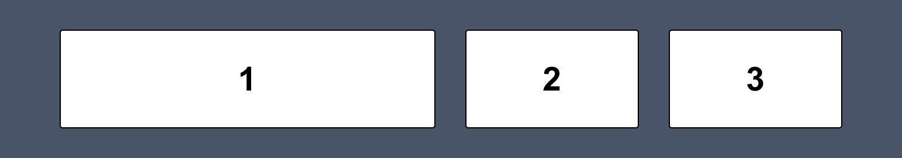

# Week 4 - Dinsdag

- [Week 4 - Dinsdag](#week-4---dinsdag)
- [Inhoud](#inhoud)
  - [Flexbox](#flexbox)
    - [Parent/child](#parentchild)
    - [Flexbox in een Flexbox](#flexbox-in-een-flexbox)
    - [Meest gebruikte Flexbox-opties](#meest-gebruikte-flexbox-opties)
    - [Flexbox-inspector 🔍](#flexbox-inspector-)
    - [Hulpbronnen voor Flexbox](#hulpbronnen-voor-flexbox)
- [Mini oefeningen - Flexbox](#mini-oefeningen---flexbox)

 
 

# Inhoud

## Flexbox

In de afgelopen lessen heb je elementen alleen nog maar *onder elkaar* gezet. Wil je de mogelijkheid om elementen ook
*naast elkaar* te zetten? Dan kan je Flexbox gebruiken. Naast de mogelijkheid om elementen naast elkaar te zetten, krijg
je ook de mogelijkheid om de uitlijning van de elementen te bepalen. Kijk maar eens naar het volgende voorbeeld:

 
Met slechts 4 regels code van Flexbox krijg je het eindresultaat dat de drie elementen naast elkaar staan, dat er een ruimte tussen de elementen zit, dat ze als geheel de hele breedte vullen en dat element 1 dubbel zo groot is als element 2 en 3. Maar het volgende is bijvoorbeeld ook mogelijk:
  

 
Om dit eindresultaat te krijgen heb je zelfs maar 3 regels code van Flexbox nodig. Hopelijk krijg je hiermee al een eerste indruk wat de kracht van Flexbox is en dat je met weinig code totaal andere layouts kan maken dan je tot nu toe hebt gedaan.

 

> Naast Flexbox heb je ook nog Grid. Deze techniek staat ook in de Export-kolom in het beoordelingsmodel. Wil je hier
> meer over weten? Zie de [hulpbronnen bij de eindopdracht](../eindopdracht/).

 

### Parent/child

Zoals gezegd kan je met een paar regels code al veel voor elkaar krijgen met Flexbox, maar je moet wel eerst weten hoe
het werkt. Het begint met een HTML-tag instellen als Flexbox. Al zijn directe *children* kunnen vervolgens naar wens
worden ingesteld met de Flexbox-opties. Zie de afbeelding hieronder. Links in de afbeelding zie je de code die we voor
dit voorbeeld gebruiken: de `<main>` met daarin drie keer een `<section>`. In HTML-termen spreken we er nu van dat
de `<main>` de *parent* is en de drie keer `<section>` die erin staan de *children*. Aan de rechterkant van onderstaande
afbeelding zie je deze parent/child relatie ook nog eens met kleuren uitgebeeld.

> De termen *parent* en *children* komen vaak terug bij HTML, dus onthoudt ze goed!

### Flexbox in een Flexbox

Let erop dat in bovenstaand voorbeeld alleen de `<main>` een Flexbox is en dus alleen de drie keer `<section>` kunnen
worden vormgegeven met Flexbox. Dus stel, in de tweede `<section>` staat ook inhoud die je met Flexbox wil vormgeven,
dan stel je die `<section>` ook simpelweg in als Flexbox en dan heb je ook weer alle mogelijkheden. Zo krijg je dus een
Flexbox, in een Flexbox, in een Flexbox, etc. Dit is goed! We raden aan om zoveel mogelijk Flexbox te gebruiken om je
layout te bepalen.

 

### Meest gebruikte Flexbox-opties

De Flexbox-opties zijn grofweg in te delen in twee categorieën: *parent-opties* en *child-opties*. Zoals de naam al
verraad
stel je de parent-opties in op de parent en heeft invloed op alle children. De child-opties stel je op de children zelf
in en heeft alleen invloed op de children waarop je het instelt.

**Flexbox-opties parent**

| Optie           | Omschrijving                                                                                           |
| --------------- | ------------------------------------------------------------------------------------------------------ |
| display: flex;  | Hiermee stel je een HTML-tag in als Flexbox.                                                           |
| flex-direction  | Instellen of de children in een rij of kolom getoond moeten worden.                                    |
| justify-content | Bepaalt de uitlijning op de hoofdas (dus de richting die gekozen is bij flex-direction).               |
| align-items     | Bepaalt de uitlijning op de dwars-as (dus het tegenovergestelde van wat gekozen is bijflex-direction). |
| flex-wrap       | Bepaalt of de Flexbox op één rij moet blijven, of zich mag verdelen over meerdere rijen.               |
| gap             | Bepaalt de ruimte tussen de children.                                                                  |

 

**Flexbox-opties child**

| Optie       | Omschrijving                                                                                         |
| ----------- | ---------------------------------------------------------------------------------------------------- |
| flex-grow   | Bepaalt hoeveel deze child mag groeien t.o.v. de andere children.                                    |
| flex-shrink | Bepaalt hoeveel deze child mag krimpen t.o.v. de andere children.                                    |
| flex-basis  | Bepaalt de standaardgrootte van de child voordat de resterende ruimte wordt verdeeld.                |
| flex        | Dit is de shorthand-notatie van bovenstaande drie opties. Het wordt aangeraden om deze te gebruiken. |
| align-self  | Deze optie is dezelfde als align-items, maar wordt hier alleen toegepast op de specifieke child.     |

Voor het volledige overzicht, [zie deze documentatie](https://css-tricks.com/snippets/css/a-guide-to-flexbox/#aa-flexbox-properties).

 

### Flexbox-inspector 🔍

Om erachter te komen wat er allemaal mogelijk is met Flexbox gebruik je de `inspector`. Hierin kun je namelijk met
simpelweg drukken op knopjes veel opties uitproberen. Inspecteer een HTML-element die staat ingesteld als een Flexbox en
klik rechts van `display: flex` op het Flexbox-knopje. Voor meer info, bekijk de volgende
video: https://developer.chrome.com/docs/devtools/css/flexbox/

 

> Reminder: je opent de inspector door met de rechter muistoets op een specifiek HTML-element te klikken en vervolgens
> op **Inspecteren**, óf met de sneltoets ⌥⌘i op Mac en F12 op Windows.

 

### Hulpbronnen voor Flexbox

1. [A Complete Guide to Flexbox](https://css-tricks.com/snippets/css/a-guide-to-flexbox/)
2. [Flexbox cheatsheet](./images/css-flexbox-poster.png) 

 
 

# Mini oefeningen - Flexbox

[Klik hier om naar de mini-oefeningen te gaan.](./mini-oefeningen)