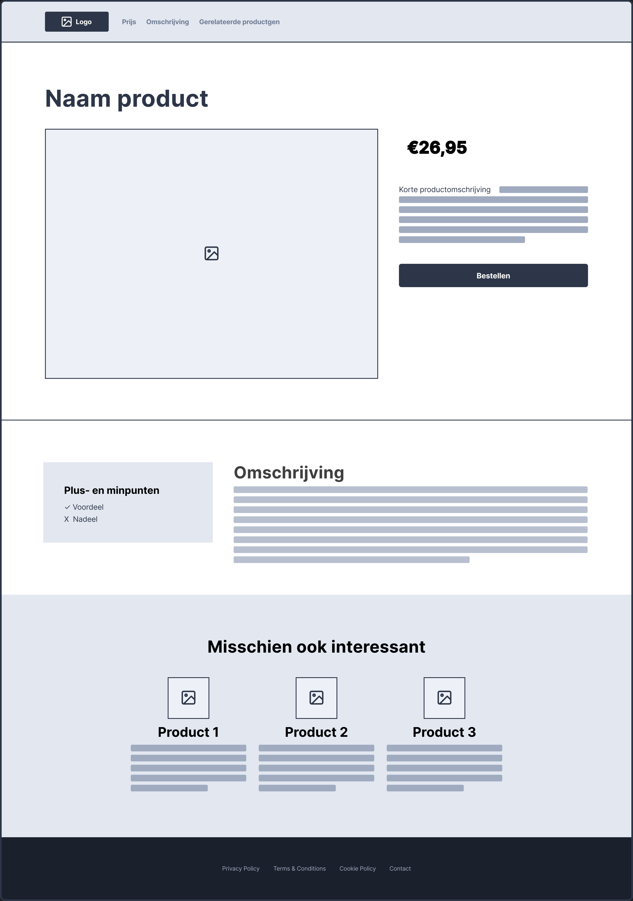

# Week 4 - Donderdag

## Inleveropdracht

In deze opdracht bouw je een wireframe na met de skills uit de eerste 4 lessen. Je gebruikt het wireframe als layout voor een *productpagina*. De content voor de pagina mag een zelfbedacht of een bestaand product zijn. Je plaatst tekst en afbeeldingen die hier over gaan en gebruik geen *placeholder teksten* of *placeholder afbeeldingen*. De wireframe is een layout, maar geen vormgeving. Je geeft zelf een stijl aan de pagina door kleuren, afbeeldingen en lettertypes te kiezen. Je bent vrij om toevoegingen en verbeteringen aan de pagina te doen. 
 
Je gebruikt *alleen stof uit les 1 t/m les 4* om de HTML en CSS op te bouwen. Probeer zoveel mogelijk de opdracht uit te voeren vanuit je eigen begrip, en door vragen te stellen in de les.  

## Tips

- Je bouwt eerst de basisstructuur op met `semantic` tags.
- Bouw één voor één de sections na, in plaats van alles tegelijk op te willen lossen.
- Gebruik `display:flex` om elementen naast elkaar te zetten.
- Hou de `flex` documentatie bij de hand, en gebruik de `flex` inspector in je browser.
- Je kan `div` elementen gebruiken om binnen sections containers aan te maken
- Gebruik `margin`, `padding` om witruimte toe te voegen rondom je containers en binnen je containers
- 😱 Als iets niet lukt, ga dan niet "*paniek-googlen*". Geef aan waar je op vast loopt bij je docent of medestudent, of vraag een peercoach.

## Inleveren

- Maak een account op [github.com](https://www.github.com) en maak een repository voor je website
- Klik op `upload files` om je `index.html`, en `styles.css` te uploaden.
- Activeer Github Pages (onder "settings") en check of jouw `index.html` pagina nu zichtbaar is als live website.
- Ga naar [Brightspace](https://brightspace.hr.nl) en lever daar de link in naar je live website.
- Let op de deadline: zondag 24 september om 15:00 uur.

## Wireframe

 

[Wireframe Week4 PDF](https://github.com/HR-CMGT/frontend-2023-2024/files/12535686/WireframeWeek4.pdf)
