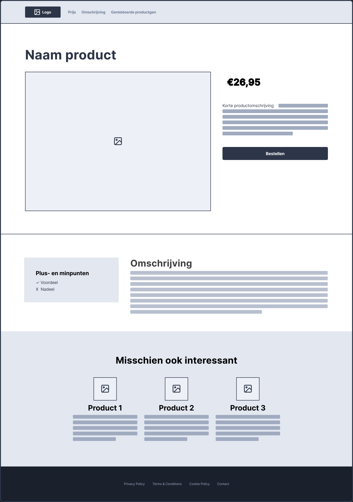

# Week 4 - Donderdag

## Tussenopdracht

In de tussenopdracht bouw je een wireframe na met de skills uit de eerste 4 lessen. Je gebruikt het wireframe als layout voor een *productpagina*. De content voor de pagina mag een zelfbedacht of een bestaand product zijn. Je plaatst teksten en afbeeldingen die hierover gaan en er mogen dus geen *placeholder teksten* of *placeholder afbeeldingen* in je pagina staan. Je geeft zelf een stijl aan de pagina door kleuren, afbeeldingen en lettertypes te kiezen.

Je gebruikt *alleen stof uit les 1 t/m les 4* om de HTML en CSS op te bouwen. Probeer zoveel mogelijk de opdracht uit te voeren vanuit je eigen begrip en door vragen te stellen in de les. Je plaatst jouw project online op GitHub pages. Je levert de link naar GitHub Pages in op Brightspace. Deze opdracht is bedoeld als voorbereiding op de eindopdracht.

## Tips

- Bouw eerst de basisstructuur op met `semantic` tags;
- Bouw één voor één de rijen na, in plaats van alles tegelijk op te willen lossen;
- Gebruik `display:flex` om elementen naast elkaar te zetten;
- Hou de `flex-documentatie` bij de hand, en gebruik de `flex-inspector` in je browser.
- Je mag `
` gebruiken om binnen sections containers aan te maken, wanneer je dit puur voor de styling nodig hebt;
- Gebruik `padding` en `margin` om witruimte toe te voegen rondom je containers en binnen je containers
- 😱 Als iets niet lukt, ga dan niet "*paniek-googlen*". Geef aan waar je op vastloopt bij je docent, medestudent of peercoach.

## Inleveren

- Maak een account op [github.com](https://www.github.com). Dit account ga je de rest van je studieloopbaan (en daarna) gebruiken;
- Maak een `repository` aan voor deze tussenopdracht;
  - Voer `repository name` in (*bv. frontend-tussenopdracht*);
  - Zorg ervoor dat `Public` is aangevinkt;
  - De overige velden kan je voor nu ongewijzigd laten en klik op `Create repository`;
- Klik op `uploading an existing file` om je `index.html`, en `style.css` te uploaden en klik vervolgens op `Commit changes`;
  - Let op: sleep de index.html en de css-map het scherm in, zodat de mappenstructuur behouden blijft;
- Activeer Github Pages (Settings -> Pages) door onder het kopje **Branch** de optie `main` te selecteren en vervolgens op `Save` te klikken;
- Refresh deze pagina een paar minuten later en dan staat bovenin de link naar jouw website;
- Ga naar [Brightspace](https://brightspace.hr.nl/d2l/le/lessons/28886/topics/169219) en lever daar deze link in;
- Let op de deadline: zondag 24 september om 17:00 uur.

## Wireframe

 

[Wireframe tussenopdracht PDF](./images/wireframe-tussenopdracht.pdf)
