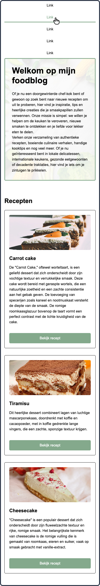
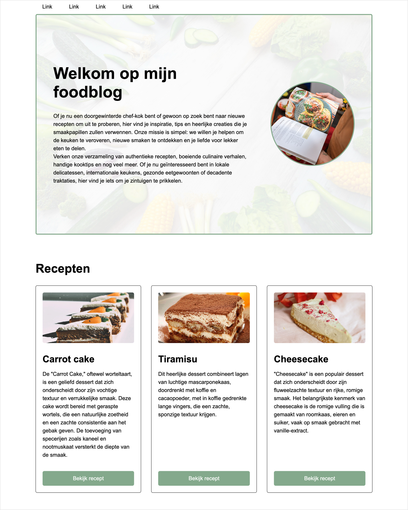

# Week 5 - Dinsdag

> *“A Pixel is Not a Pixel”*

- [Week 5 - Dinsdag](#week-5---dinsdag)
- [Inhoud](#inhoud)
  - [Responsive design](#responsive-design)
    - [Meta viewport](#meta-viewport)
    - [Absolute en relatieve units](#absolute-en-relatieve-units)
    - [Media queries](#media-queries)
    - [Flex columns](#flex-columns)
  - [Afbeeldingen](#afbeeldingen)
    - [Object fit](#object-fit)
    - [Achtergrondafbeeldingen](#achtergrondafbeeldingen)
  - [Expert: Afbeeldingen aanpassen voor device](#expert-afbeeldingen-aanpassen-voor-device)
    - [Verschillende DPI waarden](#verschillende-dpi-waarden)
    - [Werken met picture](#werken-met-picture)
  - [Links](#links)
- [Opdracht: Foodblog responsive](#opdracht-foodblog-responsive)
  - [Eindresultaat mobile](#eindresultaat-mobile)
  - [Eindresultaat desktop](#eindresultaat-desktop)

<br><br><br>

# Inhoud

## Responsive design

- meta-viewport
- Werken met absolute en relatieve units
- Media queries
- Flex row naar flex column

<br>

### Meta viewport

```html
<meta name="viewport" content="width=device-width, initial-scale=1" />
```

<br>

### Absolute en relatieve units

| Eenheid | Voorbeeld          | Toepassing                                                           |
| ------- | ------------------ | -------------------------------------------------------------------- |
| px      | `width: 100px;`    | Een absolute pixel afmeting                                          |
| vw      | `width: 40vw;`     | 40vw betekent 40% van de viewport width                              |
| vh      | `height: 30vh;`    | vh betekent % van de viewport height                                 |
| %       | `width: 20%;`      | De breedte is 20% van de parent container                            |
| rem     | `font-size: 2rem;` | De font size is 2 maal de font-size die op de `html` staat ingesteld |
| %       | `font-size: 120%;` | De font size is 120% van de parent font-size                         |

<br>

### Media queries

Schermafmetingen

```css
@media (max-width: 1000px) {}
@media (min-width: 250px) {}
@media (width >= 600px) {}
@media (width <= 400px) {}
@media (400px <= width <= 1000px) {}
```
Andere eigenschappen

```css
@media (orientation: portrait) {}
@media (prefers-color-scheme: dark) {}
@media (prefers-reduced-motion) {}
@media (min-width: 600px) and (orientation: landscape) {}
```


<br>

### Flex columns

```css
.nav {
  display:flex;
  flex-direction:row;
}
@media (orientation: portrait) {
    .nav {
        flex-direction:column;
    }
}
```


<br><br><br>

## Afbeeldingen

- Afbeelding formaten: `webp`, `png`, `jpg`, `gif`, `svg`, lazy loading.
- Door alleen de hoogte of breedte aan te passen blijft de verhouding correct
- Images plaats je meestal in een container. De image afmeting is 100% van de container. De maat van de container bepaal je met flex.
- Aspect-ratio
- Afbeeldingen in je images folder hebben vaak niet dezelfde verhouding. 
- Werken met object-fit
- Werken met achtergrondafbeeldingen
- Werken met DPI waarden: `srcset`
- Werken met `picture`

<br>

### Object fit

Object fit gebruik je om een afbeelding altijd binnen zijn container te laten passen, zonder dat de verhouding vertekend raakt. `object-fit:cover` betekent dat er randen van de zijkant weg mogen vallen om de afbeelding passend te maken. `object-fit:contain` betekent dat er witruimte toegevoegd mag worden om de afbeelding passend te maken.

In dit voorbeeld staat de afbeelding in een `div`. Dit is vaak het meest praktisch, omdat de `div` al een afmeting toegewezen krijgt door je `flex` instellingen. De afbeelding wordt dan zo groot als die `div`.

HTML
```html
<div>
  
<div>
```
CSS
```css
img {
  width: 100%;
  height: 100%;
  object-fit: cover;
}
```
<br>

Standaard wordt het midden van de afbeelding getoond, maar stel, het hoofdonderwerp staat ergens anders op de afbeelding, bijvoorbeeld onderaan, dan kan je met `object-position` de gewenste positie bepalen:
CSS
```css
img {
  width: 100%;
  height: 100%;
  object-fit: cover;
  object-position: bottom;
}
```
<br>

### Achtergrondafbeeldingen

Het voordeel van een achtergrondafbeelding is dat je er nog content overheen kan zetten. Dit leent zich goed voor HERO / Header elementen. Let op dat een leeg element van zichzelf geen hoogte / breedte heeft, dus dit moet je via CSS instellen.

HTML
```html
<header><header>
```
CSS
```css
header {
  width: 50vw;
  height: 30vh;
  background-image:url(../images/background.webp);
  background-repeat: no-repeat;
  background-position: center;
  background-size: cover;
}
```
<br>

## Expert: Afbeeldingen aanpassen voor device

### Verschillende DPI waarden

Met `srcset` kan je voor hogere DPI schemen een scherpere / grotere afbeelding inladen. `2x` betekent een retina scherm. 

```html

```
<br>

### Werken met picture

Met het picture element kan je kiezen om voor verschillende schermen (landscape, portrait) een hele andere afbeelding te laden. In dit voorbeeld zien we een portret op kleine schermen en een overview op grote schermen.

```html
<picture>
  <source media="(max-width: 799px)" srcset="robot-480-portrait.jpg" />
  <source media="(min-width: 800px)" srcset="robot-800-landscape.jpg" />
</picture>
```


<br><hr><br>
 
## Links
  
- [Guide to responsive images](https://elad.medium.com/a-complete-guide-for-responsive-images-b13db359c6c7)
- [Werken met `srcset` en `picture`](https://css-tricks.com/a-guide-to-the-responsive-images-syntax-in-html/)
- [Object Fit](https://www.w3schools.com/css/css3_object-fit.asp)
- [Lazy Loading](https://www.w3schools.com/tags/att_img_loading.asp)
- [Youtube responsive images](https://www.youtube.com/watch?v=fp9eVtkQ4EA)
- [CSS Units](https://developer.mozilla.org/en-US/docs/Learn/CSS/Building_blocks/Values_and_units)
- [Media queries](https://developer.mozilla.org/en-US/docs/Web/CSS/CSS_media_queries/Using_media_queries) en [Media query ranges](https://css-tricks.com/the-new-css-media-query-range-syntax/)


<br><hr><br>

# Opdracht: Foodblog responsive

Hieronder staat het eindresultaat op mobile én op desktop wat je moet zien te bereiken. In de startcode werkt veel al op desktop, maar nog niet alles klopt én ook is niet alles al optimaal ingesteld, waardoor het op kleinere schermen nog niet overeenkomt met het eindresultaat wat je hieronder ziet. Zorg er dus voor dat je tot onderstaand eindresultaat komt. Hou voor mobile een maximale breedte van `480px` aan, dus stel daar je media-query op in.

> Let erop dat de headings op mobile iets kleiner zijn dan op desktop, dus bedenk een slimme manier om dit gemakkelijk aan te passen, zodat je niet iedere heading los hoeft in te stellen op mobile.

<br>

> Aangezien je op een touchscreen geen hover-state hebt, betekent het handje in onderstaand eindresultaat een *tap*, dus dat je erop drukt.

## Eindresultaat mobile


## Eindresultaat desktop
