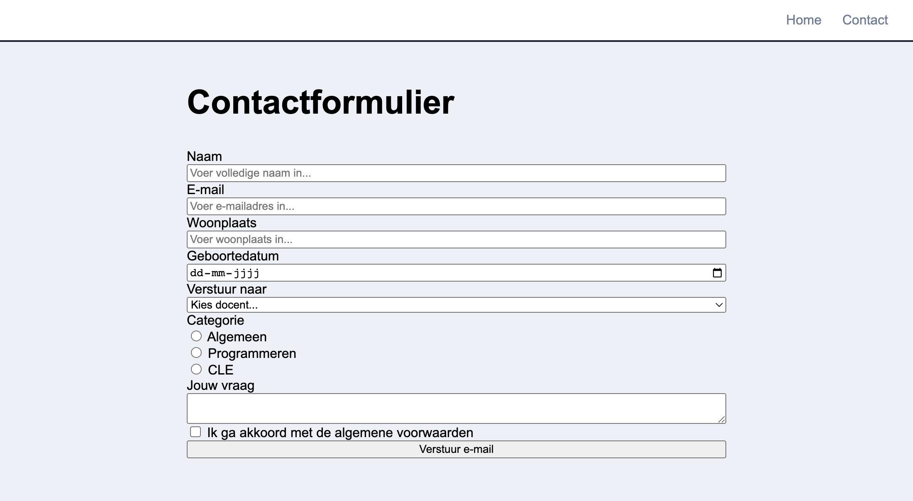

# Week 5 - Donderdag

**Inhoudsopgave**
- [Week 5 - Donderdag](#week-5---donderdag)
- [Inhoud](#inhoud)
  - [Formulieren](#formulieren)
  - [Type invoervelden](#type-invoervelden)
    - [Voorbeelden van input](#voorbeelden-van-input)
    - [Voorbeeld van select](#voorbeeld-van-select)
    - [Checkboxes](#checkboxes)
    - [Radio buttons](#radio-buttons)
    - [Meer form elementen](#meer-form-elementen)
  - [Required fields](#required-fields)
  - [Formulier versturen](#formulier-versturen)
    - [Data verwerken](#data-verwerken)
  - [Styling](#styling)
    - [Styling voor checkboxes en radio buttons](#styling-voor-checkboxes-en-radio-buttons)
- [Formulier responsive maken](#formulier-responsive-maken)
    - [Mobile](#mobile)
  - [Validatie feedback met CSS](#validatie-feedback-met-css)
- [Opdracht: Forms](#opdracht-forms)
  - [Opdracht 1: Bestandsstructuur opzetten](#opdracht-1-bestandsstructuur-opzetten)
  - [Opdracht 2: HTML formulier](#opdracht-2-html-formulier)
  - [Opdracht 3: CSS formulier](#opdracht-3-css-formulier)
  - [Opdracht 4: Responsive](#opdracht-4-responsive)
  - [Opdracht 5: Validatie](#opdracht-5-validatie)
  - [Opdracht 6: het formulier versturen](#opdracht-6-het-formulier-versturen)
    - [Namen van invulvelden](#namen-van-invulvelden)
- [Links](#links)


<br><br><br>

# Inhoud

<br>

## Formulieren
Het is met HTML mogelijk om een formulier te maken die de gebruiker kan invoeren. Met CSS is dit formulier vervolgens volledig naar wens te vormgeven. In deze les zal je leren hoe je zo'n formulier maakt, welke opties er zijn en hoe je deze vormgeeft.

Hieronder vind je een voorbeeld van een standaard formulier:

```html
<form>
    <label for="first-name">Voornaam</label>
    <input type="text" name="first-name" id="first-name">

    <label for="last-name">Achternaam</label>
    <input type="text" name="last-name" id="last-name">

    <button type="submit">Verzenden</button>
</form>
```

<br><br>


## Type invoervelden

In een formulier plaats je de gewenste invoervelden. De meeste invoervelden maak je met de HTML-tag `<input>`, maar er zijn ook een aantal andere HTML-tags. In de tabellen hieronder staan de meestgebruikte HTML-tags voor invoervelden en de meestgebruikte input-types.

<br>

**HTML-tags voor invoervelden**

| HTML-tag | Omschrijving                                                                                                                                                                                                                                                                |
| -------- | --------------------------------------------------------------------------------------------------------------------------------------------------------------------------------------------------------------------------------------------------------------------------- |
| input    | Meestgebruikte HTML-tag voor invoervelden. Door het attribuut `type` in te voeren bepaal je het type invoerveld. Zie de tabel hieronder met de meestgebruikte input-types.                                                                                                  |
| textarea | Een tekstveld met meerdere regels. Hierin kan je dus ook enters invoeren.                                                                                                                                                                                                   |
| select   | Een dropdown om een lijst met opties weer te geven. Iedere optie voer je in de `<select>` in als `<option>`. De gebruiker kan maximaal 1 optie kiezen.                                                                                                                      |
| label    | Dit is geen invoerveld, maar de label die aangeeft wat de inhoud van het bijbehorende invoerveld moet zijn. Ieder invoerveld moet een label hebben. Wanneer je op de label klikt, wordt het bijbehorende invoerveld geselecteerd (mits je de koppeling juist hebt gemaakt). |

<br><br>

**Input-types**

De tag `<input>` kan je gebruiken voor meerdere type invoervelden. De keuze maak je door het attribuut `type` in te voeren. Dus bijvoorbeeld `<input type="email">`. In de tabel hieronder vind je de types die we voor deze les nodig hebben. Hier vind je alle mogelijke input-types: [https://www.w3schools.com/html/html_form_input_types.asp](https://www.w3schools.com/html/html_form_input_types.asp)

| Input-type | Omschrijving                    |
| ---------- | ------------------------------- |
| text       | Invoerveld voor tekst           |
| email      | Invoerveld voor een emailadres. |
| checkbox   | Invoeren van een checkbox       |
| radio      | Invoeren van een radio-button   |
| date       | Invoeren van een datepicker     |


<br>

### Voorbeelden van input

```html
<label for="first-name">Naam:</label>
<input type="text" id="first-name" name="first-name">

<label for="birthdate">Datum</label>
<input type="date" id="birthdate" name="birthdate">

<label for="email">Email</label>
<input type="email" id="email" name="email">
```
<br>Met het attribuut `placeholder` kan je de gebruiker een voorbeeld geven van wat er in het veld ingevuld moet worden:
```html
<input type="email" id="email" name="email"  placeholder="studentnummer@hr.nl">
```
<br>

### Voorbeeld van select

```HTML
<label for="cars">Kies een auto</label>
<select id="cars" name="cars">
    <option value="">Kies een auto</option>
    <option value="volvo">Volvo</option>
    <option value="saab">Saab</option>
    <option value="fiat">Fiat</option>
    <option value="audi">Audi</option>
</select>
```
<br>

### Checkboxes

```html
<input type="checkbox" id="cat" name="cat" value="Cat">
<label for="cat">Ik heb een kat</label>

<input type="checkbox" id="dog" name="dog" value="Dog">
<label for="vehicle2">Ik heb een hond</label>

<input type="checkbox" id="capibara" name="capibara" value="Capibara">
<label for="vehicle3">Ik heb een capibara</label>
```

<br>

### Radio buttons

Let op dat je hier het attribuut `name` voor iedere input hetzelfde moet invoeren. De gebruiker kan hierdoor maar één van de opties selecteren.

```html
<input type="radio" id="pizza" name="menu" value="pizza">
<label for="pizza">Pizza</label>

<input type="radio" id="sushi" name="menu" value="sushi">
<label for="sushi">Sushi</label>

<input type="radio" id="kaas" name="menu" value="kaas">
<label for="kaas">Kaassoufflé</label>
```
<br>

### Meer form elementen

Op W3Schools vind je nog meer voorbeelden voor [Forms](https://www.w3schools.com/html/html_forms.asp) en [Form Elements](https://www.w3schools.com/html/html_form_elements.asp)

<br>
<br>

## Required fields

Je kan velden verplicht maken met het attribuut `required`. Wanneer de gebruiker dan het formulier submit, terwijl het verplichte veld nog leeg is, dan wordt hier een melding van getoond en wordt het formulier niet verzonden. Dit attribuut verwacht geen waarde. Je zet dus niet `required=""` neer, maar slechts `required`.

> *Let op dat dit niet gebruikt kan worden voor security (het `required` field is te omzeilen via de browser inspector)*

```html
<label for="username">Username:</label>
<input type="text" id="username" name="username" required>
```

<br><br>

## Formulier versturen

Om de data van je formulier te kunnen versturen moet je ***alle*** invulvelden binnen een `<form>` staan. Die moet weer het attribuut `action` bevatten, waarin bepaald naar welke URL het formulier verzonden moet worden.

Om het formulier te kunnen verzenden heb je wel een submit button nodig! Zie hieronder een voorbeeld van een formulier met submit button.

```html
<form action="contact-bedankt.html">
    <!-- Hier komen ALLE form elementen -->

    <!-- De submit button verstuurt het formulier -->
    <button type="submit">Versturen</button>
</form>
```

### Data verwerken

In kwartaal 2 en 3 gaan we leren hoe we de ingevulde data uit het formulier kunnen gebruiken in onze applicatie.

- Kwartaal 2: Gebruik **PHP** om de data op te slaan in een database.
- Kwartaal 3: Gebruik **Javascript** om de data te gebruiken in een front-end applicatie.

<br><br>

## Styling

De default styling van veel form-elementen is niet erg mooi en niet optimaal leesbaar. Gelukkig kan je form-elementen volledig naar wens vormgeven met CSS. Een aantal tips om het leesbaarder te maken:
- stel de `font-size` van de inputs in op de standaard font-size door deze op `1rem` in te stellen;
- voeg `padding` toe om de leesbaarheid te verbeteren.

```css
/* voorbeeld: alle input elementen */
input {
    font-size:1em;
}
/* voorbeeld: alleen text input */
input[type=text] {
    padding:2px;
    font-size:1em;
}

select {
  padding: 6px;
  font-size: 1em;
  border: 0;
}
```

<br>Ook de submit button is geheel naar wens vorm te geven. Dit werkt nagenoeg hetzelfde zoals je een `<a>` zou vormgeven, met als uitzondering dat op een button de muisaanwijzer niet automatisch een handje wordt wanneer die op de button staat. Dit kan je oplossen door de CSS-optie `cursor` op `pointer` in te stellen. Zie hieronder een voorbeeld.

```css
button {
  padding: 6px;
  font-size: 1em;
  border-radius: 8px;
  border: 0;
  background-color: darkblue;
  color: white;
  cursor: pointer;
}

button:hover {
  background-color: lightblue;
  color:darkblue;
}

button:active {
    background-color: red;
}
```

<br>

### Styling voor checkboxes en radio buttons

[Bekijk hier een voorbeeld.](https://www.w3schools.com/howto/howto_css_custom_checkbox.asp)


<br>
<br>
<br>

# Formulier responsive maken

Op desktop zet je de labels meestal naast je form-element. Dit kan je doen door het label en form-element in een `div` te plaatsen die je vervolgens als Flexbox instelt.

```html
<div class="formfield">
    <label for="name">Naam</label>
    <input type="text" name="name" id="name">
</div>

<div class="formfield">
    <label for="email">Email</label>
    <input type="email" name="email" id="email">
</div>
```
```css
.formfield {
  display: flex;
  justify-content: space-between;
  flex-direction:row;
}
```
### Mobile

Op mobile veranderen we de `flex-direction` in `column` zodat de items onder elkaar komen te staan.
```css
@media (max-width: 480px) {
  .formfield  {
    flex-direction:column;
  }
}
```

<br><br>

## Validatie feedback met CSS

Je kan via CSS de stijl aanpassen van een form element dat niet goed is ingevuld. 

```html
<input type="email" required>
```
```css
input:invalid {
    border: 3px solid red;
    background-color:pink;
}
input:valid {
    border: 3px solid green;
    background-color:lightgreen;
}
```
Je kan kijken of er nog placeholder tekst in het formulier veld staat. Dit wordt dan niet als ongeldig gezien. 
```css
input:invalid:not(:placeholder-shown) {
    border:3px solid red;
}
```

<br><br>

# Opdracht: Forms
In de komende opdrachten werk je toe naar een compleet formulier met alle opties die hierboven zijn besproken. Dit formulier ga je op een andere pagina maken dan de homepage. Dus je hebt de `index.html`, waar je tot nu toe in het hebt gewerkt, wat de homepage is. In onderstaande opdracht ga je ook een `contact.html` maken, waarin jouw formulier komt te staan. Dit bestand bekijk je via een andere URL dan de homepage, waardoor je dus twee verschillende pagina's kan bezoeken.

<br>

## Opdracht 1: Bestandsstructuur opzetten
1. Maak in jouw lesmap een nieuwe map aan en noem die `forms`. Zet daarin de bestandsstructuur neer, zoals omschreven in [opdracht 1d uit les 1](../week3-dinsdag/#opdracht-1d---bestandsstructuur-html-en-css).
2. Maak vervolgens in de nieuwe map `forms` nog een bestand aan met de naam `contact.html`. Kopieer de volledige inhoud van `index.html` en plak deze in `contact.html`. Dubbelcheck of je nu in beide bestanden dezelfde link hebt naar de `style.css`, zodat je dezelfde stijl op beide pagina's kan gebruiken.
3. Kopieer vervolgens de volgende startcode. Pas nog wel in beide HTML-bestanden de `href` van alle linkjes aan in de `<nav>`, zodat deze linken naar de juiste pagina. Voor meer info over hoe je dit correct instelt, [lees dit dan hier terug bij les 3](../week4-dinsdag/#html-voor-de-navigatie).
4. Open de `index.html` met Live Server en controleer of de navigatie werkt. Wanneer je naar de andere pagina navigeert zou de `<h1>` moeten veranderen, want die is anders per pagina, maar de vormgeving zou wel hetzelfde moeten blijven.

<br>

> ⚠️ Zorg ervoor dat je de HTML-code ***in de `<body>`*** plakt!

<br>


**index.html**
```html
<nav>
    <a href="">Home</a>
    <a href="">Contact</a>
</nav>

<main>
    <div class="center-container">
        <section>
            <h1>Homepage</h1>
        </section>
    </div>
</main>
```

<br>

**contact.html**
```html
<nav>
    <a href="">Home</a>
    <a href="">Contact</a>
</nav>

<main>
    <div class="center-container">
        <section>
            <h1>Contactformulier</h1>
        </section>
    </div>
</main>
```

<br>

**style.css**
```css
* {
    box-sizing: border-box;
}

body {
    margin: 0;
    font-family: Arial, Helvetica, sans-serif;
    background-color: #EDF0F7;
}

h1 {
    font-size: 2.5rem;
}

.center-container {
    margin: 0 auto;
    width: 90vw;
    max-width: 650px;
}

nav {
    background-color: #FFFFFF;
    padding: 15px 30px;
    display: flex;
    justify-content: flex-end;
    gap: 15px;
    border-bottom: 2px solid #1A202C;
}

nav a {
    color: #717D96;
    text-decoration: none;
}

nav a:hover {
    text-decoration: underline;
}
```

<br><br>

## Opdracht 2: HTML formulier
Schrijf de HTML. Voer de placeholders in en maak alle velden `required`;
Alleen HTML (behalve flex column, zodat alles onder elkaar staat).
De docenten zijn: Antwan, Bas, Erik en Martijn.



<br><br>

## Opdracht 3: CSS formulier
Schrijf de CSS, zodat het eruit ziet als onderstaand ontwerp.


<br><br>

## Opdracht 4: Responsive
Zorg ervoor dat jouw formulier eruit ziet zoals in onderstaand ontwerp.


<br><br>

## Opdracht 5: Validatie
Zorg ervoor dat jouw formulier eruit ziet zoals in onderstaand ontwerp.


<br><br>

## Opdracht 6: het formulier versturen

Voor deze les hebben we een testpagina gemaakt waarmee je daadwerkelijk het formulier naar ons kan versturen. In het dropdown menu geef je aan, naar welke docent je het formulier stuurt. Je kan onderstaande voorbeeldcode gebruiken.

### Namen van invulvelden

Voor deze test moeten je invulvelden de volgende `name` eigenschappen hebben: 'name', 'city', 'email', 'date', 'category', 'question' en 'send-to'. Het veld 'send-to' moet altijd 0 (Antwan), 1 (Bas), 2 (Erik) of 3 (Martijn) als waarde bevatten.

```html
<form action="https://docent.cmi.hr.nl/moora/frontend/send-mail.php" method="POST">
    
    <!-- jouw velden hier -->

    <div>
        <label class="label" for="send-to">Stuur de mail naar</label>
        <select id="send-to" name="send-to">
            <option value="0">Antwan</option>
            <option value="1">Bas</option>
            <option value="2">Erik</option>
            <option value="3">Martijn</option>
        </select>
    </div>

    <div>
        <button type="submit">Versturen</button>
    </div>
</form>
```

Maak een `contact-bedankt.html` pagina waarin je een bevestiging toont aan de gebruiker (*"We hebben uw reservering ontvangen!"*). Test of het werkt door op de `submit` button te klikken.

<br>
<br>
<br>

# Links

- [Codepen voorbeeld](https://codepen.io/eerk/pen/BaxYjqz?editors=1100)
- [MDN uitleg voor het uitlijnen van labels](https://developer.mozilla.org/en-US/docs/Web/HTML/Element/label)
- [Codepen voorbeeld met uitgebreide responsive styling](https://codepen.io/CityRay/pen/vXEaZj)
- [autocomplete](https://developer.mozilla.org/en-US/docs/Web/HTML/Attributes/autocomplete)
